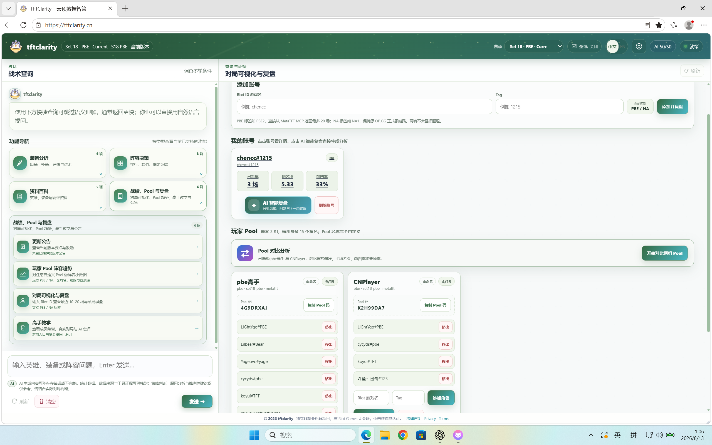
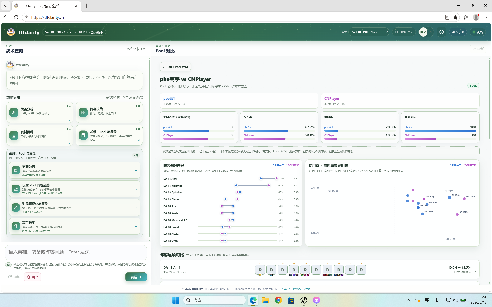

# tftclarity

> 面向《云顶之弈》的对话式数据分析与复盘工具：听得懂中文俗称，能查询阵容和装备，也能管理玩家 Pool、分析近期对局，并说明结论来自哪里。

[在线体验](https://tftclarity.cn/) · [快速开始](#快速开始) · [功能总览](#功能总览) · [玩家-pool](#玩家-pool) · [架构](#架构与可信度) · [V2 部署指南](docs/deploy-v2.md) · [发布就绪状态](docs/r1-release-readiness.md)

tftclarity V2 Public Beta 已部署至 `tftclarity.cn`。当前版本将确定性统计、ReAct Agent、多轮上下文、MetaTFT/OP.GG 玩家数据、攻略知识和证据约束解读整合到同一个 Web 界面中。

Public Beta 当前承诺已落地的查询、近期对局、Pool 和证据链能力；G4-B 装备分配优先级不在本次 Beta 承诺范围，后续仍需基于可验证的反事实证据推进。

## 当前产品界面

### 玩家 Pool 管理

每位访客最多管理 2 个 Pool，每组 1–15 个角色。Pool 支持独立增删、重命名和分享码导入；输入分享码会复制当下的成员快照，导入后的 Pool 可以独立维护，不会与原 Pool 共享编辑状态。



### 双 Pool 对比分析

当账号下有两个 Pool 时，管理页会显示明确的“开始对比两组 Pool”入口。对比页同时展示平均名次、前四率、登顶率、有效对局、阵容偏好差异、热度与效果矩阵，以及可以展开查看完整指标和代表棋盘的阵容卡片。



## 功能总览

| 分类 | 当前能力 |
| --- | --- |
| 对话式查询 | 中文自然语言、常见俗称、连续追问、条件继承与修改、无法唯一识别时的候选确认 |
| 装备分析 | 英雄三件套、已有装备补全、单件评估、多装备对比、核心装备与竞争关系 |
| 阵容决策 | 阵容排行与趋势、指定英雄、加人/下人/换人的确定性羁绊重算、可展开阵容卡片 |
| 资料百科 | 当前赛季英雄、装备、羁绊详情，中英文名称、常见俗称和版本公告 |
| 对局与复盘 | PBE/NA Riot ID、近期对局、终局棋盘、装备与羁绊、单局详情和 AI 复盘 |
| 玩家 Pool | 最多 2 组、每组 1–15 人、添加/移出/重命名、分享码一键复制、独立管理 |
| 数据看板 | 单 Pool 使用占比、热度 × 前四率气泡矩阵、均名/前四/登顶、代表棋盘 |
| Pool 对比 | 两组 Pool 的总体指标、阵容偏好差异、效果矩阵和逐阵容可展开对比 |
| 攻略知识 | YouTube 字幕知识、Bilibili 攻略搜索、版本窗排序和来源披露 |
| Agent 执行 | ReAct 多工具组合、真实流式事件时间线、证据账本、失败原因和诚实降级 |

## 典型使用方式

### 自然语言查询

不需要记住完整官方名称或 API 字段，可以直接输入：

```text
霞已经有羊刀，剩下两件怎么补？

查询这个阵容里三星贾克斯的出装，样本至少 500。

当前版本有哪些阵容正在上升？

把这个阵容的前排换成奥恩后，羁绊有什么变化？
```

系统会提取英雄、星级、阵容、装备、段位、时间窗口、样本门槛和排序目标。快捷任务走确定性低延迟路径；普通聊天可以由 ReAct Agent 连续调用多个只读工具，并把真实执行事件流式显示在界面中。

### 对局可视化与复盘

“战绩、Pool 与复盘 → 对局可视化与复盘”支持两条明确隔离的路径：

- PBE：个人查询使用 `PBE数字` 标签，例如 `Flancy#PBE2`；通过 MetaTFT Player Match MCP 返回最多 20 场近期终局数据。
- NA：使用 `NA数字` 标签，例如 `Player#NA1`；沿用 OP.GG 正式服采集与本地增量事实库。

两条路径不会互相回退。页面可展开近期对局、终局棋子、装备、羁绊和单局详情，也可以基于已取得的结构化证据生成复盘建议。外部来源没有提供的逐回合经济、搜牌路径或站位过程不会被伪造。

## 玩家 Pool

### 创建与管理

1. 打开“战绩、Pool 与复盘 → 对局可视化与复盘”。
2. 输入 Pool 名称、环境和首个 Riot ID，验证成功后创建。
3. 在 Pool 卡片中继续添加或移出角色；每组最少 1 人、最多 15 人。
4. 点击“打开数据看板”查看单 Pool 的阵容分布和表现。

Pool 名称只用于展示，不决定服务器、赛季或统计口径。环境、赛季、Provider、Patch 和有效样本会单独记录并展示。

### 分享码

- 每个 Pool 可以生成一个 8 位分享码。
- 其他访客输入分享码后，会得到成员名单的独立副本。
- 比赛事实可以复用，成员关系不会共享；任一方增删角色都不影响另一方。
- 导入仍受“每人最多 2 个 Pool、每组最多 15 人”的限制。

### 单 Pool 数据看板

数据看板不再只是原始表格，当前包含：

- 玩家覆盖、有效对局、平均名次、前四率与登顶率；
- Top 10 阵容的对局加权占比与玩家等权占比；
- “阵容热度 × 前四率”气泡矩阵，气泡大小表示样本量；
- 可展开阵容卡片，展示均名、前四、登顶、玩家覆盖和代表终局棋盘；
- 可选的完整指标表，便于核对精确值。

### 两个 Pool 如何对比

1. 创建第二个 Pool，或通过 Pool 码导入第二组成员。
2. Pool 管理页顶部的“Pool 对比分析”会从 `1/2` 变成可操作状态。
3. 点击“开始对比两组 Pool”。
4. 查看总体表现、阵容偏好哑铃图、使用率 × 前四率效果矩阵和逐阵容详情。

系统会先检查赛季、Patch 和样本覆盖。口径兼容且样本达到门槛时标记为 `FULL`；否则只并列展示观测事实，不生成“哪组更强”的结论。

## 数据口径与可信度

tftclarity 的核心原则是“统计由代码计算，模型只在证据范围内解释”。

- 对局加权：每场对局权重相同，适合观察 Pool 中实际出现了多少次。
- 玩家等权：先计算每位玩家内部的阵容占比，再在玩家之间平均，避免高频玩家支配整体结果。
- 平均名次：越低越好。
- 前四率：最终名次为 1–4 的对局比例。
- 登顶率：最终名次为 1 的对局比例。
- 样本门槛：样本不足、Patch 不齐或赛季不一致时，界面会降低结论强度并显示原因。

MetaTFT、OP.GG 和攻略平台都属于外部数据源，接口变化、网络失败和缓存过期可能影响结果。Pool 是用户自行选择的有限样本，不代表整个服务器，也不能用于推导因果关系。

## 架构与可信度

```text
用户输入 / 快捷任务
        ↓
┌──────────────────────────┬──────────────────────────┐
│ QuickTask 确定性快速路径 │ ReAct Agent 多工具路径   │
│ 解析 → 查询 → 结果策略    │ Decide → Tool → Observe │
└──────────────────────────┴──────────────────────────┘
        ↓ Conversation Bridge / Agent Event Stream
Tool Registry → Tool Executor → Evidence Ledger
        ↓
MetaTFT / Player Match MCP / OP.GG / 版本与攻略知识
        ↓
确定性聚合、样本门槛、赛季与 Patch 校验
        ↓
EvidenceBundle → 证据约束解读 → Web UI
```

主要设计约束：

- 确定性优先：实体解析、过滤、聚合、排序、指标和羁绊重算由代码完成。
- 工具白名单：Agent 只能调用注册目录中的只读工具，并受参数 Schema、超时、重复调用和无进展保护约束。
- 证据约束：模型不能提供 EvidenceBundle 中不存在的数字、实体或来源。
- 真实状态：前端保留 Agent 的实际执行事件，不用固定占位文案冒充处理进度。
- 诚实降级：样本不足、来源失败或模型输出不合格时，返回可验证的确定性结果并说明边界。
- 赛季隔离：会话、缓存、目录、Pool 统计和查询均携带赛季上下文。

## 快速开始

### 环境要求

- Windows、macOS 或 Linux
- Node.js 20+；推荐 Node.js 24
- Node.js 20–21 使用 SQLite 时需要成功安装可选依赖 `better-sqlite3`

### 本地启动

```powershell
git clone https://github.com/Chencc7002/tftclarity.git
cd tftclarity
npm install
npm start
```

打开 [http://127.0.0.1:17317/](http://127.0.0.1:17317/)，健康检查：

```powershell
Invoke-RestMethod http://127.0.0.1:17317/api/health
```

Windows 桌面小窗口：

```powershell
npm run window
```

只启动服务，不自动打开浏览器：

```powershell
npm run window:server
```

启动器的窗口尺寸、位置、置顶、浏览器路径与全局热键参数见 [Windows 小窗口启动器说明](docs/small-window-launcher.md)。

## 配置

基础静态查询可以在没有 LLM 的情况下运行。需要 ReAct Agent、语义检索、证据约束解读、攻略知识或真实玩家数据时：

```powershell
Copy-Item .env.example .env
```

常用配置：

| 配置 | 作用 |
| --- | --- |
| `TFT_AGENT_REACT_CHAT_MODE` | 开启普通聊天的 ReAct Agent 路径 |
| `TFT_AGENT_CONVERSATION_BRIDGE_MODE` | 将快捷任务的目的、条件和结果传入后续聊天 |
| `TFT_AGENT_CONCLUSION_MODE` | 开启证据约束的数据解读 |
| `TFT_AGENT_KNOWLEDGE_MODE` | 本地知识检索总开关 |
| `TFT_AGENT_EMBEDDING_MODE` | 持久化语义向量检索；生产 Compose 使用本地 `bge-m3` |
| `METATFT_PLAYER_MATCH_ENABLED` | 启用 MetaTFT Player Match MCP |
| `METATFT_PBE_ENABLED` / `METATFT_NA_ENABLED` | 分别控制 PBE 与 NA 数据路径 |
| `OPGG_PUUID_ENCRYPTION_KEY` | 可选的 PUUID 静态加密密钥；未配置时不落盘 PUUID |
| `BILIBILI_MCP_ENDPOINT` | 只读攻略视频 MCP 的内部地址 |

完整配置和安全占位符见 [.env.example](.env.example)；公开部署模板见 [.env.production.example](.env.production.example)。不要提交真实 API Key、PUUID、Cookie 或数据库密码。

## 常用命令

| 命令 | 用途 |
| --- | --- |
| `npm start` | 启动本地 Web 服务 |
| `npm run window` | 启动 Windows 桌面小窗口 |
| `npm test` | 运行 Node 自动化测试 |
| `npm run smoke:small-window` | 验证本地 API 主流程 |
| `npm run smoke:visual` | 运行多断点视觉冒烟测试 |
| `npm run smoke:metatft` | 验证 MetaTFT 数据链路 |
| `npm run smoke:metatft:player-mcp` | 验证玩家近期对局 MCP |
| `npm run smoke:react-chat:live` | 验证真实模型 ReAct 多工具聊天 |
| `npm run semantic:index` | 构建持久化语义索引 |
| `npm run semantic:audit` | 审核语义索引状态 |
| `npm run stats:daily` | 执行一次 current_stats 日任务 |
| `npm run opgg:collect:watch` | 持续增量采集 OP.GG 玩家数据 |
| `npm run eval:agent` | 运行核心 Agent 离线评估 |

真实 MetaTFT、OP.GG、Bilibili、YouTube 或模型测试会受到外部服务、网络和额度影响。

## 生产部署

生产 Compose 使用以下组件：

整体存储与执行方式为 PostgreSQL 持久业务存储、Redis 临时状态/队列、独立 Worker，并把 embedding 与外部 MCP 放在不直接暴露宿主端口的内部网络中。

- `app`：Web/API 服务；
- `worker`：异步任务；
- `postgres`：持久业务数据；
- `redis`：临时状态与队列；
- `embedding`：内部 Ollama `bge-m3`，不暴露宿主端口；
- `metatft-player-mcp`：近期玩家对局工具；
- `bilibili-mcp`：只读攻略视频工具；
- `caddy`：HTTPS、反向代理和安全头。

```bash
cp .env.production.example .env.production
docker compose --env-file .env.production up -d --build
docker compose --env-file .env.production ps
curl -fsS https://your-domain.example/api/health
curl -fsS https://your-domain.example/api/ready
```

数据库迁移、备份、健康检查、容量门槛、恢复和回滚步骤见 [V2 production 部署指南](docs/deploy-v2.md)。

## 测试与质量门槛

```powershell
npm test
npm run smoke:small-window
npm run smoke:comps
npm run eval:agent
```

测试覆盖自然语言解析、实体链接、多轮上下文、能力规划、工具安全、结果策略、阵容与装备统计、赛季隔离、缓存、SQLite/PostgreSQL、玩家 Pool、分享码、Pool 对比、近期对局 MCP、攻略知识、流式事件和前端交互。

## 进一步阅读

- [玩家 Pool 产品与统计口径](docs/player-pools.md)
- [MetaTFT Player Match MCP](docs/metatft-player-match-mcp.md)
- [R1 独立 ReAct 与 Conversation Bridge](docs/react-chat-r1-architecture.md)
- [LLM 检索与证据流水线](docs/llm-retrieval-evidence-pipeline.md)
- [语义索引构建](docs/semantic-index-build.md)
- [攻略知识与混合回答](docs/youtube-hybrid-operations.md)
- [管理员赛季与数据运维](docs/admin-season-operations.md)
- [V2 production 部署、恢复与回滚](docs/deploy-v2.md)
- [V1 腾讯云部署指南（历史单机参考）](docs/deploy-tencent-cloud-v1.md)
- [Riot 法务与生产部署说明](docs/riot-legal-production-deploy.md)

## 数据来源与项目声明

- MetaTFT 用于当前统计和 PBE 玩家终局数据；它是非官方外部来源。
- OP.GG 用于正式服玩家与职业池的增量观察；有限样本不代表全服 Meta。
- Riot 官方公告只用于版本事实。
- YouTube、Bilibili 和其他攻略内容只用于原因、背景与条件性建议，并保留来源披露。
- `.probe/` 中的离线捕获样本只用于回归测试、目录审核和数据契约验证。

tftclarity 是由玩家独立制作的非商业粉丝项目，与 Riot Games 不存在隶属、合作、赞助或认可关系。Riot Games、Teamfight Tactics 及相关角色、图像、名称和游戏资产归 Riot Games 或其权利人所有。
