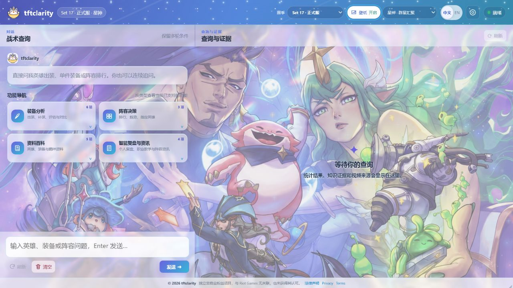
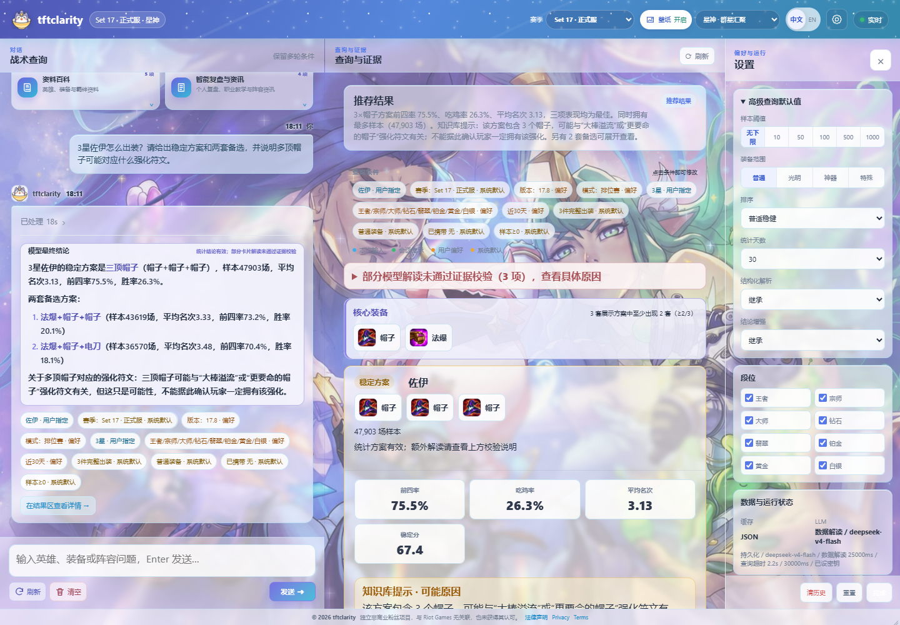
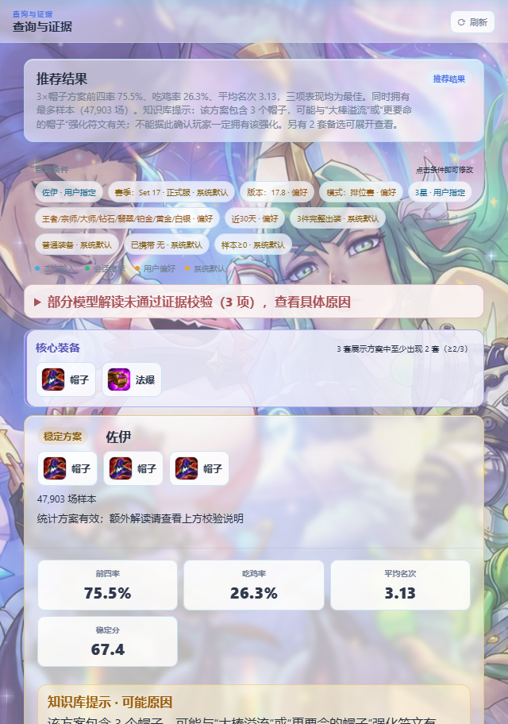
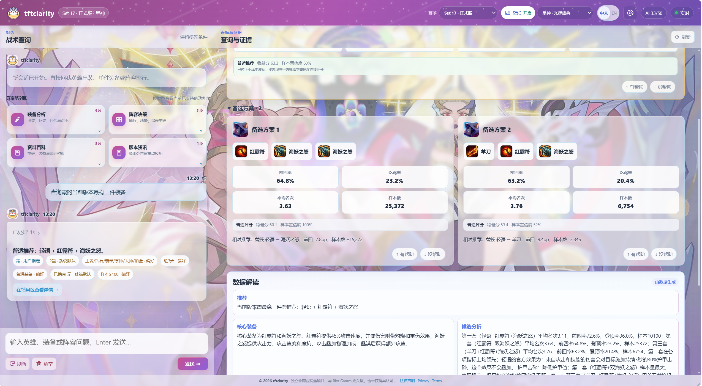
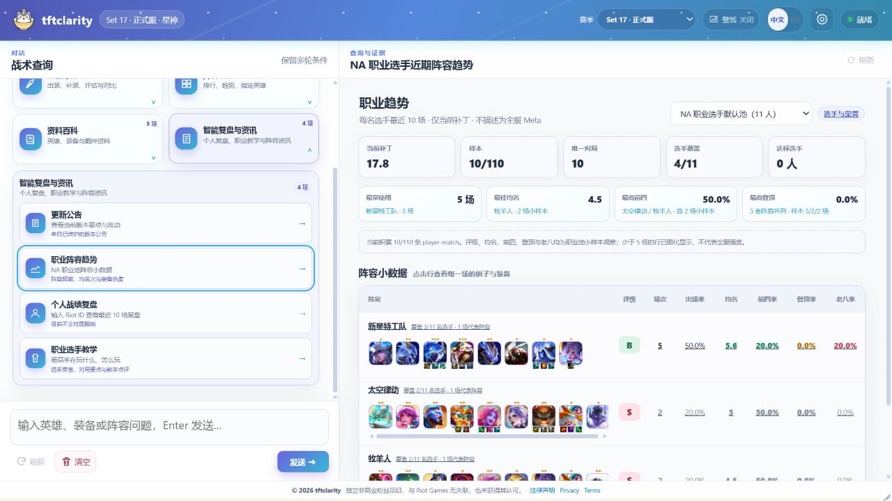

# tftclarity

> 听得懂中文俗称，帮你快速得到结论，也说清楚结论从哪里来。

[在线体验：https://tftclarity.cn/](https://tftclarity.cn/) · [快速开始](#快速开始) · [功能总览](#功能总览) · [架构与可信度](#架构与可信度) · [部署指南](docs/deploy-tencent-cloud-v1.md)



tftclarity 把“霞有羊刀后两件怎么补”“当前有哪些阵容正在上升”这类问题转换为受控的结构化查询，结合 MetaTFT 统计、版本快照、攻略知识和可选的 AI 解读，返回首选方案、备选方案、样本规模、风险提示与证据来源。

项目可作为浏览器 Web 应用、本地 Windows 小窗口或公开服务运行。目前仍处于测试阶段，在线站点主要用于个人使用、功能验证和项目演示，不承诺长期可用性或稳定性。

## V2 开发版状态

当前 `codex/chatbot` 分支是 tftclarity **第二版开发基线**。V2 已完成独立 ReAct Agent、QuickTask 会话桥接、多工具组合查询、证据约束结论和可编辑查询条件等核心改造，但**本版本尚未部署**；上方在线地址仍运行上一版，不能用于判断 V2 的当前能力。

### V2 界面预览



V2 会同时展示模型结论、可修改的查询条件和工具返回的证据。下图为“3 星佐伊出装”结果区：稳定方案、两套备选、核心装备、样本与关键指标保持在同一证据链中；重复帽子的强化符文关联只作为知识库中的可能原因提示，不会被写成确定事实。



> 截图来自本地 V2 开发服务，查询条件与统计时间以图中展示为准；该界面尚未部署到线上版本。

V2 当前重点：

- 普通聊天由 ReAct Agent 根据问题动态选择工具，可连续执行英雄、装备、阵容、站位和知识检索等多步查询。
- 快捷工具继续走确定性快速路径；工具目的、关键条件和结果会通过 Conversation Bridge 进入后续普通聊天上下文。
- 出装查询保留并展示赛季、版本、模式、星级、段位、时间窗口、装备数量和样本门槛，用户可以点击条件继续修改。
- 阵容支持加人、下人和换人后的确定性羁绊人数及档位重算；模型只负责解释结构变化，不自行编造羁绊统计。
- 站位解释必须基于工具返回的棋盘位置和攻击距离，不能在文本中改写英雄所在排数。
- 用户策略知识以不确定性规则接入检索和结果证据。例如重复帽子或杀人剑可以提示可能相关的强化符文，但不能反推玩家一定拥有该强化。
- 当前开发验收不设置工具调用次数上限，保留总时限、决策次数、重复调用和无进展保护，用于观察模型边界与幻觉频率。

V2 的架构、验收矩阵和阶段结论见 [R1 独立 ReAct 与 QuickTask Conversation Bridge](docs/react-chat-r1-architecture.md) 与 [R1 验收报告](docs/r1-acceptance-report.md)。

## 为什么使用 tftclarity？

- **快速得到结论**：不必在完整榜单中反复筛选，系统直接给出首选方案、备选方案、关键指标和下一步建议。
- **中文俗称支持**：可以直接说“羊刀、无尽、巨杀、石像鬼、挑战者转”，无需记住官方全名或 API 名称。
- **自然语言连续追问**：支持在多轮对话中继承英雄、阵容、星级、装备和样本条件，也可以随时修改要求。
- **结论可追溯**：同时展示样本规模、缓存新鲜度、风险提示和证据来源，低样本或数据不足时不会强行下结论。

## 功能总览

| 分类 | 已实现能力 |
| --- | --- |
| 装备分析 | 英雄三件套、已有装备补全、单件评估、多装备对比、特殊装备识别、核心装备信号 |
| 阵容决策 | 热门阵容排行、上升/下降趋势、阵容分析、指定阵容棋子出装、条件筛选与排序，以及加人、下人、换人后的确定性羁绊人数与档位重算 |
| 资料百科 | 当前赛季英雄、装备、羁绊详情，中文/英文名称与常见俗称，当前版本公告 |
| 智能复盘与资讯 | OP.GG 职业池趋势、个人近期对局复盘、职业选手教学、YouTube 攻略知识检索、可扩展用户策略知识 |

### 中文俗称支持与连续追问

不需要记住完整官方名称或 API 字段，可以直接使用“羊刀、无尽、巨杀、石像鬼、挑战者转”等常见说法，也支持简繁中文、部分拼音、英雄简称和旧称。

```text
霞已经有羊刀，剩下两件怎么补？

查询这个阵容里三星贾克斯的出装，样本至少 500。

推荐 3 套不卷、适合新手的九五阵容。

当前版本有哪些阵容正在上升？
```

系统会解析英雄、星级、阵容、装备、段位、统计时间、样本门槛和排序目标，并在后续对话中继承或修改条件。实体无法唯一确定时会要求确认，不会静默猜测。

### 快速得到结论

常规数据网站更适合浏览完整榜单和手动筛选原始数据；tftclarity 更关注从“提出问题”到“做出选择”的速度。结果不仅展示平均名次、前四率、登顶率、选择率和样本数，还会直接组织为：



- 首选方案与备选方案
- 推荐理由和适用条件
- 样本覆盖、缓存新鲜度与稳定性
- 低样本、过期数据或无法判定时的风险提示
- 统计、版本公告和攻略知识的证据来源

AI 只在证据范围内解释数据，不能改写底层统计。生成内容必须通过证据 ID、实体、数字和风险边界校验；模型不可用或校验失败时，系统会返回确定性模板结果。

### 职业趋势与智能复盘



OP.GG 工作流支持职业选手池和个人关注池，能够增量采集近期对局、去重、按补丁隔离，并生成：

- 职业池阵容频率、选手覆盖、平均名次、前四率、登顶率与老八率
- 代表棋盘、单位出场率和装备组合热度
- 单个选手近期对局与风格复盘
- 基于结构化证据的 AI 教学点评

职业池数据属于有限样本观察，不代表全服 Meta；样本不足时界面会弱化评级并明确标注。当前个人复盘不支持国服账号。OP.GG 单次接口返回量有限，因此正式复盘依赖本地定期增量积累。

### 赛季、界面与本地小窗口

- 中文/英文界面、响应式桌面与移动布局
- 赛季白名单、主题色、壁纸和快捷问题随赛季上下文切换
- 不可用的 PBE/预览赛季不会回退到正式服数据
- Windows 浏览器 App 小窗口、置顶定位与全局热键唤回
- 查询理解过程、工具执行进度、证据和结果分区展示
- 匿名访问隔离、使用额度、反馈记录和受保护的管理入口

## 架构与可信度

```text
用户输入
  ↓
Chat Router
  ↓
┌─────────────────────────────┬──────────────────────────────┐
│ QuickTask 确定性快速路径     │ ReAct 普通聊天动态工具路径     │
│ ExecutionPlan / ResultPolicy │ Decide → Tool → Observe 循环  │
└─────────────────────────────┴──────────────────────────────┘
                ↓ Conversation Bridge
ToolRegistry / ToolExecutor / Evidence Ledger
  ↓
MetaTFT / current_stats / OP.GG / 攻略与版本知识
  ↓
EvidenceBundle / Grounded Narrative
  ↓
Termination Policy + 结论校验
  ↓
HTTP API / Web 界面 / Windows 小窗口
```

核心设计原则：

- **确定性优先**：查询解析、过滤、聚合、指标计算和基础排序由代码完成。
- **双路径执行**：快捷工具保留低延迟 ExecutionPlan；普通聊天由 ReAct 循环动态组合已注册的只读工具。
- **受控执行**：工具必须来自注册目录并通过参数 Schema；开发验收阶段不限制调用次数，但仍受总时限、决策次数、重复调用、重试和无进展保护约束。
- **证据约束**：模型不能提供 EvidenceBundle 中不存在的数字、实体或 API 名称。
- **诚实降级**：缺少历史快照、样本过低、外部服务失败或模型输出不合格时，明确说明边界并返回可验证结果。
- **赛季隔离**：会话、缓存、目录和查询都携带赛季上下文，跨赛季切换不会继承旧条件。
- **来源分层**：MetaTFT 用于当前统计，官方公告用于版本事实，攻略内容只用于原因和条件性建议，职业池观察不冒充全服数据。

### 数据与存储

默认本地模式可使用 JSON 缓存；SQLite 模式用于持久化查询缓存、赛季目录、会话、偏好、反馈、语义索引、`current_stats` 快照和 OP.GG 增量对局。

SQLite 当前服务于单机开发、低成本部署和完整链路验证，并不代表最终生产数据架构。后续可在不改变 `TaskFrame → ExecutionPlan → ToolExecutor` 主链的前提下，将业务存储、缓存、对象文件和定时任务拆分到 PostgreSQL、Redis、对象存储与独立 Worker。

## 快速开始

### 环境要求

- Windows、macOS 或 Linux
- Node.js 20 或更高版本（安全版 MCP 依赖的最低要求）
- 推荐 Node.js 22.5+ 或 24：可直接使用 `node:sqlite`，也能运行 OP.GG 增量采集；生产 Docker 镜像固定为 Node 24
- Node.js 20–21 如需 SQLite，必须成功安装可选依赖 `better-sqlite3`

### 安装与启动

```powershell
git clone https://github.com/Chencc7002/tftclarity.git
cd tftclarity
npm install
npm start
```

打开 [http://127.0.0.1:17317/](http://127.0.0.1:17317/)，或检查服务状态：

```powershell
Invoke-RestMethod http://127.0.0.1:17317/api/health
```

Windows 桌面小窗口：

```powershell
npm run window
```

只启动服务、不自动打开浏览器：

```powershell
npm run window:server
```

启动器还支持端口、窗口尺寸、位置、置顶、浏览器路径和热键参数，详见 [Windows 小窗口启动器说明](docs/small-window-launcher.md)。

## 可选 AI 与检索配置

基础数据查询不要求配置 LLM。需要增强自然语言解析、语义检索、证据约束解读、OP.GG 教学或 YouTube 攻略提取时：

```powershell
Copy-Item .env.example .env
```

然后填写所使用的 OpenAI-compatible 服务配置。不要把真实 API Key、PUUID 或其他凭据提交到 Git。

| 配置 | 作用 |
| --- | --- |
| `TFT_AGENT_LLM_MODE` | 结构化自然语言解析策略 |
| `TFT_AGENT_CONCLUSION_MODE` | 证据约束的数据解读 |
| `TFT_AGENT_KNOWLEDGE_MODE` | 本地知识检索总开关 |
| `TFT_AGENT_EMBEDDING_MODE` | 持久化语义向量索引 |
| `TFT_AGENT_COACH_MODE` | 攻略与统计混合的教练回答 |
| `TFT_AGENT_REACT_CHAT_MODE` | 开启 V2 ReAct 普通聊天路径；本地验收使用 `on` |
| `TFT_AGENT_CONVERSATION_BRIDGE_MODE` | 让 QuickTask 目的、条件和结果进入后续聊天上下文 |
| `TFT_AGENT_OPGG_TEACHING_TIMEOUT_MS` | OP.GG AI 教学单次尝试超时 |
| `OPGG_PUUID_ENCRYPTION_KEY` | 可选的 PUUID 静态加密密钥；未配置时不落盘 PUUID |

完整配置和安全占位符见 [.env.example](.env.example)，公开部署示例见 [.env.production.example](.env.production.example)。

## 常用命令

### 开发与验证

| 命令 | 用途 |
| --- | --- |
| `npm start` | 启动本地 Web 服务 |
| `npm run window` | 启动 Windows 桌面小窗口 |
| `npm test` | 运行完整 Node 自动化测试 |
| `npm run smoke:small-window` | 验证本地 API 主流程 |
| `npm run smoke:visual` | 运行多断点视觉冒烟测试 |
| `npm run smoke:sqlite` | 验证 SQLite 持久化与重开缓存 |
| `npm run smoke:metatft` | 验证真实 MetaTFT 数据链路 |
| `npm run smoke:react-chat:live` | 验证真实模型 ReAct 多工具聊天链路 |
| `npm run eval:agent` | 运行核心 Agent 离线评估 |

涉及 MetaTFT、OP.GG、YouTube 或真实模型的命令会受到外部服务状态、网络和额度影响。

### 数据与索引

| 命令 | 用途 |
| --- | --- |
| `npm run stats:generate` | 生成 `current_stats` 快照 |
| `npm run stats:daily` | 执行一次带锁、重试和告警的每日任务 |
| `npm run stats:scheduler` | 启动 Node 常驻调度器 |
| `npm run stats:schedule:windows` | 安装 Windows 每日计划任务 |
| `npm run semantic:index` | 构建持久化语义索引 |
| `npm run semantic:audit` | 审核语义索引状态 |
| `npm run refresh:item-localization` | 刷新装备本地化数据 |
| `npm run audit:aliases` | 审核英雄、羁绊和装备别名覆盖 |
| `npm run audit:items` | 审核当前装备可用性规则 |
| `npm run audit:item-patch` | 对比版本间装备目录变化 |
| `npm run backup:sqlite` | 创建并校验 SQLite 备份 |

`current_stats` 的数据范围、保留精度、趋势阈值和告警方式均可在 `.env` 中配置。设计与验收记录见 [current_stats 架构和浏览器 E2E 报告](docs/current-stats-architecture-and-browser-e2e-report-2026-07-29.md)。

### OP.GG 职业池与复盘

```powershell
# 采集默认职业池；定时模式每 60 分钟轮询一次
npm run opgg:collect
npm run opgg:collect:watch

# 查看采集统计和职业池趋势
npm run opgg:stats
npm run opgg:trends

# 查看单个选手的确定性复盘或 AI 教学
npm run opgg:review -- --player broseph-lab
npm run opgg:teaching -- --player broseph-lab
```

可使用 `--pool`、`--pool-create`、`--roster-add` 和 `--roster-remove` 管理自定义关注池。职业选手名单、荣誉资料与 PUUID 分离保存；真实 PUUID 不应写入仓库。

### YouTube 攻略知识

```powershell
npm run youtube:import -- --url <URL>
npm run smoke:youtube
npm run youtube:acceptance
```

视频字幕由 Python 服务提取，Node 服务负责入库、检索、EvidenceBundle 和最终回答。未经人工审核的摘要会在 Schema、HTTP Evidence 和界面中标记“AI 生成 · 未经人工复核”，并保留原视频时间点链接。完整流程见 [YouTube 攻略知识与混合回答操作说明](docs/youtube-hybrid-operations.md)。

## 测试与质量门槛

```powershell
npm test
npm run smoke:small-window
npm run smoke:comps
npm run eval:agent
```

测试覆盖自然语言解析、实体链接、多轮上下文、能力规划、工具安全、结果策略、阵容与装备统计、赛季隔离、缓存、SQLite、OP.GG 聚合与复盘、YouTube 知识、HTTP API、流式进度和前端交互。

阶段性 Agent 评估和验收结果见：

- [Agent 升级进度](docs/agent-upgrade-progress.md)
- [Phase 6.6 架构收敛](docs/phase-6-6-architecture-convergence.md)
- [R1 独立 ReAct 与 QuickTask Conversation Bridge](docs/react-chat-r1-architecture.md)
- [受控失败学习闭环](docs/reports/phase-8a-controlled-failure-loop.md)
- [MVP 验证矩阵](docs/mvp-verification-matrix.md)

## V2 后续开发

V2 后续工作以“先扩展能力和验收，再考虑部署”为原则：

1. 扩展 YouTube、哔哩哔哩等视频攻略搜索、字幕抽取、来源时间点和人工复核流程。
2. 将用户策略知识从代码内规则继续演进为可维护、可审核、可版本化的知识库，并记录适用赛季与置信边界。
3. 完善阵容、棋子、装备、站位、强化符文之间的多工具组合案例和长对话上下文继承。
4. 建立模型边界与幻觉频率评估，记录原始自由文本、证据校验结果、失败原因和人工审核结论。
5. 补齐真实数据、真实模型、小窗口交互和 CI 分层门禁；全部通过后再单独制定 V2 部署与回滚计划。

本分支的提交和推送不代表发布。除非另行执行并审核部署流程，否则不会更新 `tftclarity.cn` 的线上版本。

## 进一步阅读

- [LLM 检索与证据流水线](docs/llm-retrieval-evidence-pipeline.md)
- [LLM 与会话记忆架构](docs/memory-llm-architecture.md)
- [Question Contract 与 ConclusionSpec Registry](docs/question-contract-conclusion-spec.md)
- [阵容排行数据来源](docs/comp-ranking-data-source.md)
- [语义索引构建](docs/semantic-index-build.md)
- [管理员赛季与数据运维](docs/admin-season-operations.md)
- [腾讯云部署指南](docs/deploy-tencent-cloud-v1.md)

## 数据来源与项目声明

- MetaTFT 是非官方外部数据源，接口变化、网络失败或缓存过期可能影响实时查询。
- OP.GG 职业池数据是小样本观察，不能替代全服统计，也不能推导稳定因果关系。
- 官方版本公告只用于版本事实；攻略与 AI 摘要只用于原因、背景和条件性建议。
- `.probe/` 保存离线捕获样本，用于回归测试、目录审核和数据契约验证。

tftclarity 是由玩家独立制作的非商业粉丝项目，与 Riot Games 不存在隶属、合作、赞助或认可关系。Riot Games、Teamfight Tactics 及相关角色、图像、名称和游戏资产归 Riot Games 或其权利人所有。
