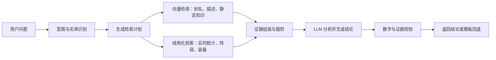
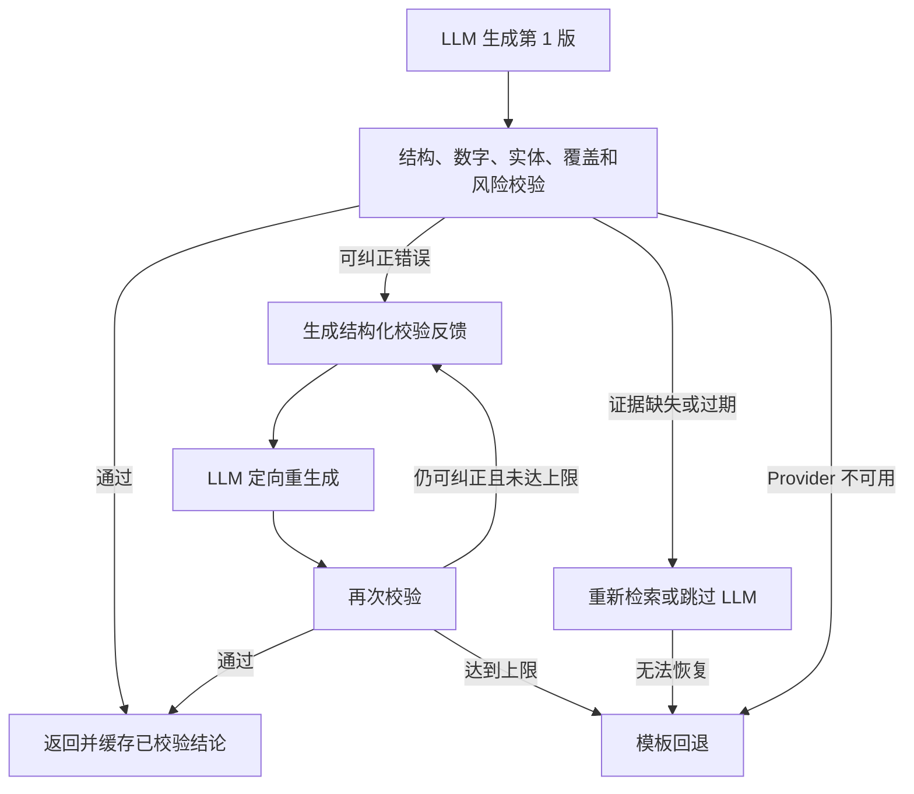

# TFTAgent LLM 检索、证据与结论生成流程设计

更新时间：2026-07-17
状态：P0–P3 已实现（本地 TF-IDF 为默认语义降级；真实 Embedding 与线上数据 smoke 仍需部署配置）
适用范围：TFTAgent 后端查询、语义检索、证据组装、LLM 数据解读与前端降级展示

## 1. 文档目标

本文档定义 TFTAgent 下一阶段统一的 LLM 工作流，用于指导后续开发、测试和验收。目标流程为：



并非所有意图都必须经过全部节点。当前版本的棋子资料、装备资料和羁绊资料在结构化检索后直接返回前端，不进入 LLM 结论生成；主流程主要用于需要比较、排序和数据权衡的查询。

该流程需要解决以下问题：

1. 不同自然语言表达能够稳定识别为同一个查询意图，例如“剑圣哪个转职好”和“剑圣有什么强的转职”。
2. 棋子、装备、羁绊和阵容的别名能够解析为当前版本的准确 API 实体。
3. 实时统计数据仍由 MetaTFT 等结构化数据源提供，不由向量相似度或 LLM 猜测。
4. 前端展示的全部关键证据进入受控上下文，使 LLM 能比较样本量、平均名次、前四率、登顶率、登场率等指标。
5. LLM 结论必须通过数字、实体、证据覆盖和风险边界校验；校验失败时优先定向纠错，最终才使用模板回退。

## 2. 核心设计原则

### 2.1 向量检索负责语义召回，结构化检索负责事实

向量检索适合处理：

- 意图样例和自然语言变体；
- 棋子、装备、羁绊、阵容的名称、别名和简称；
- 技能、装备、羁绊等相对稳定的说明文本；
- 当前会话的短期摘要或已确认实体。

向量检索不得直接决定：

- 哪个装备、转职或阵容最强；
- 平均名次、样本数、前四率、登顶率、登场率；
- 最近三天排名变化；
- 当前版本的最终排序和比较胜负。

实时数值、筛选条件、统计口径和排序必须来自结构化接口与本地确定性算法。

### 2.2 精确规则优先，向量召回补充

实体解析优先级：

```text
API ID 精确命中
> 当前版本规范名称精确命中
> 当前版本别名精确命中
> 关键词与规则命中
> 向量相似度候选
> LLM 结构化消歧
```

向量结果是候选，不得覆盖已确认的高置信精确命中。低于阈值、跨版本冲突或同分歧义时，应请求澄清或保留多个候选，不得静默猜测。

### 2.3 LLM 只解释证据，不重算和改写事实

LLM 可以：

- 综合多个指标解释推荐与取舍；
- 区分纸面表现、样本可靠性和稳定选择；
- 总结不同用户偏好对应的选择；
- 给出有边界的下一步建议。

LLM 不可以：

- 修改查询条件、实体、样本阈值或统计结果；
- 编造证据包中不存在的数字、装备、棋子、羁绊或阵容；
- 将相关性描述为因果关系；
- 绕过低样本、过期数据和版本冲突提示；
- 使用向量相似度作为强度排名依据。

### 2.4 降级不影响核心查询

无论向量服务、Embedding 服务或结论模型是否可用，结构化查询、排序卡片和模板答案都必须保持可用。LLM 增强层失败时不得改变核心推荐结果。

### 2.5 LLM 只解读用户可见证据

LLM 的分析范围必须与前端展示范围一致。凡是对结论产生实质影响的候选、指标和衍生信号，都必须已经显示在前端，或能由用户展开查看；不得使用一批用户看不到的隐藏候选支撑更强的结论。

以三件套推荐为例：

- 前端展示三个三件套时，Evidence Pack 只需包含这三个方案的完整指标，以及仅由这三个方案确定性计算出的可见重复装备信号；
- LLM 可以比较这三套的表现、样本可靠性和取舍，也可以说明某件装备是“当前展示方案的共同组件”；
- LLM 不得据此宣称该装备是该棋子所有玩法的全局核心；
- 用户询问“核心装备”时，应路由到 `unit_item_rankings`，展示单装备频率、样本和表现后再作判断。

该原则保证用户能够从页面证据复核模型结论，也避免隐藏统计口径与前端卡片不一致。

## 3. 当前基础与改造边界

当前项目已经具备以下基础：

| 能力 | 当前模块 | 后续改造方向 |
|---|---|---|
| 查询解析和意图识别 | `src/core/recommendation-service.js` | 输出统一 `IntentEnvelope`，接入检索计划器 |
| 实体候选检索 | `src/llm/entity-candidate-retriever.js` | 从单一 TF-IDF 候选器升级为带类型和版本元数据的语义检索接口 |
| 高置信实体消歧 | `src/core/high-confidence-entity-resolver.js` | 合并精确命中、向量候选、版本约束和置信度 |
| MetaTFT 查询及确定性排序 | `src/core/recommendation-service.js` 及数据适配器 | 封装为按意图执行的结构化检索器 |
| LLM 证据包 | `src/llm/conclusion-evidence.js` | 升级为统一 Evidence Pack，并标记来源、时效和证据优先级 |
| 结论生成与缓存 | `src/core/conclusion-service.js` | 支持错误分类、可配置纠错次数和完整事件指标 |
| 结论校验 | `src/llm/conclusion-validator.js` | 增加分析覆盖、样本可靠性和衍生信号校验 |
| OpenAI 兼容 Provider | `src/llm/conclusion-provider.js` | 保持结构化输出，补充纠错反馈契约 |

本次改造不应推翻现有查询和排序逻辑，而是在现有能力上增加统一编排层。

## 4. 目标端到端流程

### 4.1 阶段一：意图与实体识别

输入：用户原始问题、已确认的会话上下文、当前版本目录。
输出：`IntentEnvelope`。

建议契约：

```json
{
  "schemaVersion": "intent_envelope.v1",
  "input": "剑圣有什么强的转职",
  "intent": "unit_emblem_rankings",
  "confidence": 0.94,
  "entities": [
    {
      "type": "unit",
      "mention": "剑圣",
      "apiName": "TFT17_MasterYi",
      "canonicalName": "易大师",
      "confidence": 1.0,
      "resolution": "exact_alias"
    }
  ],
  "constraints": {
    "days": 3,
    "minSamples": null,
    "rankFilter": []
  },
  "requestedMetrics": ["avgPlacement", "top4Rate", "winRate", "games"],
  "needsClarification": false,
  "warnings": []
}
```

处理顺序：

1. 运行现有确定性解析器。
2. 使用目录和别名字典进行精确实体匹配。
3. 对未命中、歧义或自然语言变体运行语义候选检索。
4. 必要时调用结构化 LLM 解析器做最终消歧，但其输出仍需目录校验。
5. 置信度不足时返回澄清，不进入数据查询和结论生成。

### 4.2 阶段二：生成检索计划

新增 `RetrievalPlanner`，把意图转换成明确、可观测、可测试的检索任务。

建议契约：

```json
{
  "schemaVersion": "retrieval_plan.v1",
  "intent": "unit_emblem_rankings",
  "structuredQueries": [
    {
      "source": "metatft",
      "operation": "unit_builds",
      "params": {
        "unit": "TFT17_MasterYi",
        "days": 3
      },
      "required": true
    }
  ],
  "semanticQueries": [
    {
      "index": "entity_and_static_knowledge",
      "query": "剑圣有什么强的转职",
      "types": ["unit", "trait", "emblem_description"],
      "patch": "17.7",
      "locale": "zh-CN",
      "topK": 5,
      "required": false
    }
  ],
  "evidenceBudget": {
    "maxItems": 40,
    "maxCharacters": 16000
  }
}
```

规划器必须是白名单路由：每种意图只能调用预先允许的数据源和操作，不能让 LLM 自由生成 URL 或任意 API 参数。

### 4.3 阶段三：向量检索

向量检索按需执行。精确意图和实体已经完全确认、且查询只需要实时统计时，可以不调用 Embedding 服务。

语义文档建议结构：

```json
{
  "id": "unit:TFT17_MasterYi",
  "documentType": "unit",
  "text": "易大师 剑圣 无极剑圣 Master Yi",
  "metadata": {
    "apiName": "TFT17_MasterYi",
    "canonicalName": "易大师",
    "aliases": ["剑圣", "易", "Master Yi"],
    "patch": "17.7",
    "locale": "zh-CN",
    "source": "catalog",
    "updatedAt": "2026-07-17T00:00:00Z"
  }
}
```

首期语义语料分为：

1. `intent_example`：每个意图的多种真实问法。
2. `unit`、`item`、`trait`、`comp`：名称、别名、简称和 API ID。
3. `unit_description`、`item_description`、`trait_description`：技能、属性、效果和合成说明。
4. `session_summary`：仅限当前会话、带过期时间的已确认上下文。

实时统计不得作为长期语义文档写入向量库。若因检索需要短期索引，必须带数据时间、版本、过滤条件和严格 TTL，并且最终事实仍以结构化数据为准。

### 4.4 阶段四：结构化数据检索

结构化检索器根据 `RetrievalPlan` 调用现有目录、MetaTFT 接口和本地缓存。

建议意图路由：

| 意图 | 主要结构化来源 | 必须返回的核心证据 |
|---|---|---|
| `unit_build_rankings` | MetaTFT unit builds | 三件套、样本数、平均名次、前四率、登顶率 |
| `unit_best_3_items` | MetaTFT unit builds、本地聚合 | 单件装备频率、表现、样本可靠性、代表套装 |
| `unit_item_rankings` | MetaTFT unit builds、本地聚合 | 每个候选装备的完整展示指标与样本量 |
| `unit_item_comparison` | MetaTFT unit builds、本地排他样本 | 比较双方指标、胜负或无法判定原因 |
| `unit_emblem_rankings` | MetaTFT unit builds、本地聚合 | 每个转职的样本数、平均名次、前四率、登顶率 |
| `comp_rankings` | MetaTFT comps data/stats | 展示阵容的完整卡片指标、统计口径和更新时间 |
| `comp_trends` | MetaTFT 官方趋势字段及本地确定性评分 | 名次变化、登场率、综合趋势分、时间窗口 |
| `unit_details` | 当前版本官方目录 | 属性、技能、费用、羁绊、推荐装备证据 |
| `item_details` | 当前版本官方目录 | 属性、效果、合成路线、可用性 |
| `trait_details` | 当前版本官方目录 | 各层级效果、数值和激活条件 |

结构化检索结果必须包含：来源、版本或 cluster、统计时间、过滤条件、缓存状态和原始数值。

其中 `unit_details`、`item_details`、`trait_details` 在本阶段属于“结构化直出”意图：完成目录查询和前端序列化后即结束，不构建结论 Evidence Pack，也不调用结论 Provider。表中的“推荐装备证据”等字段仅表示页面可展示的数据，不代表需要模型二次解读。

### 4.5 阶段五：证据组装与裁剪

新增统一 `EvidenceAssembler`，合并结构化证据和语义证据，同时保留权威级别。

建议契约：

```json
{
  "schemaVersion": "llm_evidence_pack.v2",
  "request": {
    "intent": "unit_emblem_rankings",
    "inputSummary": "查询易大师的强势转职",
    "entities": ["TFT17_MasterYi"]
  },
  "query": {
    "days": 3,
    "rankFilter": ["CHALLENGER", "GRANDMASTER", "MASTER", "DIAMOND", "EMERALD", "PLATINUM"]
  },
  "structuredEvidence": [
    {
      "evidenceId": "emblem:challenger",
      "type": "emblem_ranking",
      "name": "挑战者转",
      "stats": {
        "games": 830,
        "avgPlacement": 3.79,
        "top4Rate": 0.633,
        "winRate": 0.195
      },
      "reliability": "stable",
      "authority": "primary_statistics"
    }
  ],
  "semanticEvidence": [
    {
      "evidenceId": "trait:challenger:description",
      "type": "trait_description",
      "text": "挑战者羁绊的当前版本效果说明",
      "authority": "official_static_catalog"
    }
  ],
  "derivedSignals": {
    "stableCandidateIds": ["emblem:challenger", "emblem:bruiser"],
    "lowSampleCandidateIds": ["emblem:traveler"],
    "metricLeaders": {
      "avgPlacement": "emblem:traveler",
      "games": "emblem:bruiser"
    }
  },
  "warnings": [],
  "dataStatus": {
    "provider": "MetaTFT",
    "cache": "fresh",
    "updatedAt": "2026-07-17T00:00:00Z"
  },
  "generationRules": {
    "factsMustComeFromEvidence": true,
    "structuredEvidenceHasPriority": true,
    "mustCompareDisplayedCandidates": true,
    "mustDiscussSampleReliability": true,
    "forbidCausalClaims": true
  }
}
```

裁剪规则：

- 先保留所有前端实际展示且结论必须分析的卡片指标；
- 再保留用户点名的实体和比较对象；
- 再保留帮助解释的静态知识；
- 相同事实只保留一份，以 `evidenceId` 引用；
- 结构化统计证据不得被语义文档挤出预算；
- 不传 API Key、服务地址、请求头、文件路径、原始大响应或无关会话全文；
- 超出预算时记录裁剪原因，关键证据不足则跳过 LLM，而不是生成不完整结论。

### 4.6 阶段六：LLM 生成结论

模型接收完整但受控的 Evidence Pack，并返回严格 JSON。Prompt 由“共享基础 Prompt + 意图专用 Prompt”组合，不使用一份包含所有业务分支的超大 Prompt。

```text
base-conclusion.md
  + 当前 intent 对应的专用 Prompt
  + 本次 Evidence Pack
  + 可选的校验纠错反馈
```

Prompt 路由必须由服务端根据已校验的 `intent` 确定，不能让模型根据用户原文自行选择。共享基础 Prompt 统一规定：

- 所有事实必须来自证据；
- 原始数值不得自行改写；
- 结论必须覆盖用户所见的关键候选；
- 只能解读前端可见或可展开的证据；
- 必须区分低样本纸面领先和高样本稳定推荐；
- 不得把相关性写成因果；
- 无法形成可靠结论时返回 `insufficient_evidence`。

意图专用 Prompt 规定该功能的分析目标、指标方向、必须覆盖的证据和禁止越界的结论。建议路由：

| 结果或意图 | 专用 Prompt | 分析目标 |
|---|---|---|
| `unit_build_rankings`、`unit_build_completion`、`unit_best_3_items` | `conclusion-intents/unit-build-rankings.md` | 比较前端展示的三件套、共同组件、备选与风险 |
| `unit_item_rankings` | `conclusion-intents/unit-item-rankings.md` | 根据可见频率、样本与表现判断核心、次选和情境装备 |
| `unit_item_comparison` | `conclusion-intents/unit-item-comparison.md` | 按排他样本和确定性胜负比较用户指定装备 |
| `unit_emblem_rankings` | `conclusion-intents/unit-emblem-rankings.md` | 综合样本与表现判断稳定转职和低样本亮点 |
| `comp_rankings` | `conclusion-intents/comp-rankings.md` | 按请求指标分析可见阵容榜和取舍 |
| `comp_trends` | `conclusion-intents/comp-trends.md` | 综合可见名次提升、登场率和样本判断新兴阵容 |

专用 Prompt 源文件位于 `src/llm/prompts/conclusion-intents/`，组合和路由规则见 `src/llm/prompts/conclusion-prompt-registry.md`。

棋子资料、装备资料和羁绊资料暂不接入 LLM 结论生成。这三类功能继续使用当前版本目录和结构化页面直接展示，玩家可以自行阅读属性、技能、效果与合成信息。其名称、别名和必要静态说明仍可进入语义索引，帮助意图识别和实体解析，但不得因此触发结论模型调用。

建议输出继续沿用当前结论结构：

```json
{
  "schemaVersion": "llm_conclusion.v2",
  "status": "ok",
  "headline": "挑战者转和斗士转是更稳定的常规选择",
  "summary": "旅人转纸面平均名次更好，但样本较少；挑战者转和斗士转样本更充足且平均名次仍在 4 以内。",
  "reasons": [
    {
      "evidenceIds": ["emblem:traveler", "emblem:challenger", "emblem:bruiser"],
      "text": "综合平均名次和样本量后，高样本候选更适合作为稳定推荐。"
    }
  ],
  "alternatives": [],
  "nextAction": "根据当前可获得的转职，在挑战者转和斗士转之间选择。",
  "riskNotice": "旅人转样本较少，当前表现仅供参考。"
}
```

## 5. 校验、纠错重生成与模板回退

主流程图中的最后阶段需要展开为：



### 5.1 错误分类

| 错误类型 | 示例 | 处理方式 |
|---|---|---|
| `format_error` | 非 JSON、字段缺失、输出截断 | 携带格式反馈重生成 |
| `unsupported_number` | 输出了证据中不存在的百分比 | 携带错误位置和允许值重生成 |
| `unsupported_entity` | 提到证据中不存在的装备或阵容 | 携带实体白名单重生成 |
| `missing_coverage` | 遗漏前端展示的重要候选 | 携带遗漏 `evidenceId` 重生成 |
| `missing_risk_notice` | 低样本领先但未说明风险 | 携带风险规则重生成 |
| `analysis_boundary` | 把低样本榜首直接写成稳定最优 | 携带衍生信号与边界规则重生成 |
| `stale_or_missing_evidence` | 数据过期或关键指标缺失 | 重新检索；不可恢复则回退 |
| `intent_or_entity_error` | 意图或实体本身错误 | 返回解析阶段重新规划或请求澄清 |
| `provider_unavailable` | 鉴权失败、长期不可用 | 直接回退；瞬时网络错误按 Provider 策略重试 |
| `validator_false_positive` | 合法表达被规则误拒绝 | 修正校验器；重复生成不能解决 |

### 5.2 重生成策略

- 区分“语义纠错次数”和“网络传输重试次数”。
- 默认允许初次生成后最多两次语义纠错，总共最多三版结论。
- 每次只发送当前 Evidence Pack、上一版校验错误、遗漏证据和允许值，不把错误结论当作新事实。
- 第二次反馈必须去重；连续出现相同错误时可以提前回退，避免无意义循环。
- 只有通过校验的结论可以写入缓存和展示。
- 达到上限后返回原有确定性模板，并在 UI 标记“已使用模板回退”。

建议配置：

```env
TFT_AGENT_CONCLUSION_MAX_CORRECTIONS=2
TFT_AGENT_CONCLUSION_MAX_VALIDATION_ERRORS=8
```

## 6. 向量库构建方案

### 6.1 首期存储选择

当前语料规模预计为数千条，首期不需要部署独立向量数据库。建议：

1. 保留现有 TF-IDF 检索作为离线和无 Embedding Provider 时的降级方案。
2. 抽象 `SemanticRetriever` 和 `EmbeddingProvider` 接口。
3. 使用 SQLite 保存文档、元数据、内容哈希和向量。
4. 启动时按版本和类型加载必要向量到内存，使用余弦相似度检索。
5. 数据量或并发显著增长后，再评估专用向量索引。

建议表结构：

```sql
CREATE TABLE semantic_documents (
  id TEXT PRIMARY KEY,
  document_type TEXT NOT NULL,
  content TEXT NOT NULL,
  api_name TEXT,
  intent TEXT,
  patch TEXT,
  locale TEXT,
  source TEXT NOT NULL,
  content_hash TEXT NOT NULL,
  embedding_model TEXT NOT NULL,
  embedding BLOB NOT NULL,
  updated_at INTEGER NOT NULL
);
```

### 6.2 构建与增量更新

```text
当前版本目录 + 别名字典 + 人工意图样例 + 官方静态说明
  → 生成原子语义文档
  → 规范化、去重、计算 content_hash
  → 仅为新增或变化文档生成向量
  → upsert SQLite
  → 删除当前版本已不存在的文档
  → 生成索引构建报告
```

以下情况触发更新：

- TFT 版本或目录发生变化；
- 新增、删除或修改棋子、装备、羁绊、阵容；
- 别名或意图样例变化；
- 静态说明变化；
- Embedding 模型或文本规范化版本变化。

每天更新 MetaTFT 实时统计时不应重建静态向量库。

### 6.3 检索与重排

推荐采用混合检索：

```text
候选集合 = 精确名称/别名命中 ∪ 关键词命中 ∪ 向量 TopK
最终排序 = 精确匹配优先 + 当前版本过滤 + 类型过滤 + 向量相似度 + 会话上下文
```

不得用一个固定的全局相似度阈值处理全部文档类型。意图样例、短别名和长描述应分别评估阈值，并通过离线数据集确定。

## 7. 建议模块结构

```text
src/retrieval/
  retrieval-planner.js             # IntentEnvelope → RetrievalPlan
  structured-retriever.js          # 执行白名单结构化查询
  semantic-retriever.js            # 统一语义检索接口
  hybrid-reranker.js                # 精确、关键词、向量和版本联合重排
  evidence-assembler.js             # 合并、去重、裁剪和权威分级

src/llm/
  embedding-provider.js             # Embedding Provider 抽象
  entity-candidate-retriever.js     # 迁移为 SemanticRetriever 的实现或适配器
  conclusion-provider.js            # 结论模型调用
  conclusion-evidence.js            # 兼容层，逐步迁移至 EvidenceAssembler
  conclusion-validator.js           # 输出及分析边界校验
  prompts/
    recognize-intent.md
    base-conclusion.md
    conclusion-correction.md
    conclusion-prompt-registry.md
    conclusion-intents/
      unit-build-rankings.md
      unit-item-rankings.md
      unit-item-comparison.md
      unit-emblem-rankings.md
      comp-rankings.md
      comp-trends.md

src/core/
  recommendation-service.js         # 保留核心编排和确定性计算
  conclusion-service.js             # 生成、纠错、校验、缓存与降级

scripts/
  build-semantic-index.mjs          # 构建或增量更新语义索引
  audit-semantic-index.mjs          # 检查重复、缺失、跨版本污染

test/
  retrieval-planner.test.js
  semantic-retriever.test.js
  hybrid-reranker.test.js
  evidence-assembler.test.js
  llm-pipeline-e2e.test.js
```

迁移期间应保留现有公共返回结构，避免同时大改查询核心、HTTP 契约和前端。

## 8. 配置建议

```env
# 语义检索
TFT_AGENT_SEMANTIC_RETRIEVAL_MODE=hybrid
TFT_AGENT_EMBEDDING_PROVIDER=openai_compatible
TFT_AGENT_EMBEDDING_MODEL=...
TFT_AGENT_EMBEDDING_ENDPOINT=...
TFT_AGENT_SEMANTIC_TOP_K=8
TFT_AGENT_SEMANTIC_MIN_SCORE=...

# 证据预算
TFT_AGENT_EVIDENCE_MAX_ITEMS=40
TFT_AGENT_EVIDENCE_MAX_CHARACTERS=16000

# 结论纠错
TFT_AGENT_CONCLUSION_MAX_CORRECTIONS=2
TFT_AGENT_CONCLUSION_MAX_VALIDATION_ERRORS=8
```

约束：

- 所有开关默认必须允许关闭或降级；
- 未配置 Embedding Provider 时使用现有 TF-IDF；
- 未配置结论模型时只返回结构化数据和模板结论；
- Endpoint、API Key 和原始请求不得返回前端或写入普通日志；
- 向量索引、Evidence Pack 和结论缓存均必须包含版本字段。

## 9. 可观测性

每次请求记录不含敏感内容的阶段事件：

```text
intent_resolved
entity_resolved
retrieval_plan_created
semantic_retrieval_completed/skipped/failed
structured_retrieval_completed/failed
evidence_assembled/rejected
conclusion_generated
conclusion_validation_failed
conclusion_corrected
conclusion_fallback
```

建议指标：

- 意图识别准确率、澄清率；
- 实体解析准确率和歧义率；
- 语义检索 Recall@K、Top-1 准确率；
- 结构化查询成功率和缓存命中率；
- Evidence Pack 的前端证据覆盖率；
- 结论首次通过率、纠错通过率、模板回退率；
- 不支持数字、实体和遗漏证据的错误分布；
- 各阶段 P50/P95 延迟、请求 Token 和估算成本。

## 10. 测试与验收

### 10.1 意图与实体测试集

每个意图至少准备：

- 规范问法；
- 三到五个自然语言变体；
- 简称、别名和错别字；
- 与相邻意图容易混淆的反例；
- 多轮继承和用户改口场景。

重点回归：

```text
剑圣哪个转职好
剑圣有什么强的转职
剑圣应该带什么转
易大师适合什么纹章
```

以上问法在实体明确时应统一进入 `unit_emblem_rankings`，不得误判为“请求用户指定一个纹章”。

### 10.2 结构化检索测试

- 同一 `RetrievalPlan` 必须生成稳定、可预测的 API 参数；
- LLM 不得自由添加端点和参数；
- 版本、cluster、过滤条件和缓存状态必须进入结果；
- 实时统计缺失时不得从语义文档补造数字；
- 排序结果与现有确定性逻辑保持一致。

### 10.3 证据与结论测试

- 所有前端展示且要求分析的候选均有 `evidenceId`；
- Evidence Pack 不得包含用于支撑结论、但用户无法从页面查看的隐藏候选；
- 数字可以从结论精确回链到结构化证据；
- 三件套查询只能评价展示的三套；没有可见单装备排行时，不得宣称全局核心装备；
- 低样本榜首不能被无条件描述为稳定最优；
- 样本量、平均名次、前四率、登顶率冲突时，结论能够说明取舍；
- 第一次输出不合法、第二次修正合法时返回生成结论；
- 连续达到纠错上限后返回模板，不展示未校验文本；
- 缺失或过期证据触发重新检索或安全跳过，不只要求模型重写；
- 只有已校验输出进入缓存。

### 10.4 降级测试

- Embedding 服务不可用：精确规则和 TF-IDF 仍可工作；
- 结论模型不可用：结构化查询和模板答案仍可工作；
- MetaTFT 不可用且无新鲜缓存：不得用静态知识冒充实时排行；
- 校验器异常：不得显示未经校验的生成文本；
- 小窗口应明确区分“证据生成结论”和“模板回退”。
- `unit_details`、`item_details`、`trait_details` 只返回结构化资料，不调用结论 Provider。

## 11. 分阶段实施计划

### P0：统一契约和编排

1. 定义 `IntentEnvelope`、`RetrievalPlan`、`SemanticHit` 和 `EvidencePack v2`。
2. 新增 `RetrievalPlanner`，先包装现有意图路由和 MetaTFT 查询。
3. 新增 `EvidenceAssembler`，兼容现有 `buildConclusionEvidence`。
4. 保持前端及 HTTP 返回结构不变。

完成标准：不接入新 Embedding 模型时，现有查询和测试全部通过，且每次请求可以输出可审计的检索计划。

### P1：混合语义检索

1. 抽象 `SemanticRetriever` 和 `EmbeddingProvider`。
2. 将当前 TF-IDF 实现接入统一接口。
3. 建立意图样例、实体别名和静态说明语料。
4. 实现 SQLite 向量存储、内容哈希和增量构建脚本。
5. 引入真实 Embedding Provider，并保留 TF-IDF 降级路径。

完成标准：真实问句测试集中意图与实体准确率达到设定阈值，跨版本实体不会互相污染。

### P2：意图专用结构化检索

1. 将现有数据查询封装为白名单结构化检索操作。
2. 覆盖装备、转职、棋子、羁绊、阵容排行和阵容趋势。
3. 为每个意图建立必要指标、最低证据和时效规则。
4. 把检索来源、时间、版本和过滤条件纳入 Evidence Pack。

完成标准：所有主要意图都能从 `RetrievalPlan` 稳定生成完整前端证据，实时数值不依赖向量库和 LLM。

### P3：结论质量与纠错循环

1. 接入共享基础 Prompt 与按意图选择的专用 Prompt 注册表。
2. 为各意图增加分析覆盖、可见证据边界和样本可靠性规则。
3. 将最大语义纠错次数设为可配置，默认两次。
4. 生成结构化校验反馈，包含错误位置、遗漏证据和允许值。
5. 增加首次通过率、纠错通过率和重复错误提前停止。
6. 启用阵容排行、趋势、转职等结果的统一 LLM 解读。

完成标准：低样本、指标冲突和多候选场景可以得到有证据的综合结论；错误输出无法进入 UI 或缓存。

### P4：灰度、评估与优化

1. 建立离线评估集和线上匿名指标。
2. 对比规则解析、TF-IDF、Embedding 和混合检索效果。
3. 优化证据预算、延迟、缓存和调用率。
4. 根据失败分布调整语料、阈值、Prompt 和校验规则。

完成标准：核心准确性不低于改造前，模板回退率和错误意图率显著下降，延迟和成本处于预算内。

## 12. 最终验收定义

功能完成必须同时满足：

1. 用户自然语言先被解析为可审计的意图、实体和约束。
2. 每次查询都有白名单 `RetrievalPlan`，LLM 不直接控制外部数据请求。
3. 向量检索只承担语义召回和静态知识补充，不承担实时强度排序。
4. 所有实时数值来自带版本、时间和过滤条件的结构化数据源。
5. LLM 获取前端需要分析的完整证据，并能同时权衡表现和样本可靠性。
6. 结论中的数字、实体、证据覆盖和风险边界全部通过自动校验。
7. 可纠正错误会携带明确反馈重新生成；达到上限或证据不安全时才模板回退。
8. 任何 LLM、Embedding 或网络异常都不影响结构化查询和确定性模板答案。
9. 用户能在前端区分原始统计、模型解读、风险提示和模板回退。
10. 离线测试、真实 Provider smoke 和小窗口端到端验证均通过后才能灰度启用。

## 13. 当前实现记录

本轮实现基于 `codex/ui` 的 `c739d3a`，保持原有确定性查询、排序、HTTP 卡片和模板答案兼容。核心导出统一由 `src/index.js` 提供。

### 13.1 契约与编排

- `src/retrieval/contracts.js`：导出 `IntentEnvelope v1`、`RetrievalPlan v1`、`SemanticHit v1` 与 `EvidencePack v2` 构造和校验能力。
- `src/retrieval/retrieval-planner.js`：按已校验意图生成白名单计划；低置信、实体冲突或需要澄清时不生成实时查询。
- `src/retrieval/structured-retriever.js`：只允许注册的 MetaTFT 与官方目录操作，并剔除未注册参数、URL 和接口名。
- `src/retrieval/llm-pipeline.js`：提供端到端编排与阶段事件；语义检索失败不会阻塞结构化查询。

### 13.2 语义检索

- `src/retrieval/semantic-retriever.js`：提供 `SemanticRetriever`、现有实体候选 TF-IDF 适配器、通用本地 TF-IDF、Embedding 检索器与自动降级包装器。
- `src/llm/embedding-provider.js`：提供可注入的 `EmbeddingProvider` 抽象；Provider 不可用时由降级包装器转入 TF-IDF。
- `src/retrieval/semantic-document-store.js`：提供带 `contentHash` 的增量内存文档存储，并拒绝 MetaTFT 每日实时统计进入静态语义索引。
- `src/retrieval/hybrid-reranker.js`：执行 API ID、当前规范名、当前别名、关键词、向量相似度的优先级，并强制类型、版本和语言过滤。

当前没有把真实 Embedding 向量写入 SQLite，也没有引入必须独立部署的向量数据库。上线真实 Embedding 前，应按第 6 节表结构补充 SQLite 持久化、增量构建脚本和真实 Provider smoke；未配置时核心查询继续使用现有精确规则和 TF-IDF。

### 13.3 证据、Prompt 与纠错

- `src/retrieval/evidence-assembler.js`：把现有可见卡片升级为 Evidence Pack v2，结构化证据优先，语义说明只能使用剩余预算；关键可见证据缺失或超预算时安全跳过 LLM。
- `src/llm/conclusion-prompt-registry.js`：服务端按已校验意图选择基础 Prompt 和单一专用 Prompt；资料类意图不注册 Prompt。
- `src/core/conclusion-service.js`：默认“初次生成 + 最多两次语义纠错”，网络传输重试独立计数；连续相同错误可提前回退，只有通过校验的内容才写缓存。
- `src/llm/conclusion-validator.js`：输出结构化 `conclusion_validation_feedback.v1`，覆盖格式、数字、实体、证据覆盖、风险和分析边界错误。
- 小窗口沿用已有“已使用模板回退”标记；生成失败不会替换确定性卡片和模板事实。

结论缓存键包含 Evidence Schema、基础 Prompt、当前意图 Prompt、Provider Prompt 配置和模型版本。修改某个意图 Prompt 时，不会使其他意图的结论缓存失效。

### 13.4 已支持意图

结论流程：`unit_build_rankings`、`unit_build_completion`、`unit_best_3_items`、`unit_item_rankings`、`unit_item_comparison`、`unit_emblem_rankings`、`comp_rankings`、`comp_trends`。

结构化直出且不调用结论 Provider：`unit_details`、`item_details`、`trait_details`。

专项回归覆盖：转职同义问法、三张可见卡片边界、单装备全候选覆盖、低样本风险、排他比较未决、阵容趋势提升与登场基础、数字和实体证据回链、纠错成功、纠错上限回退、资料类直出，以及 Embedding/LLM 不可用降级。
