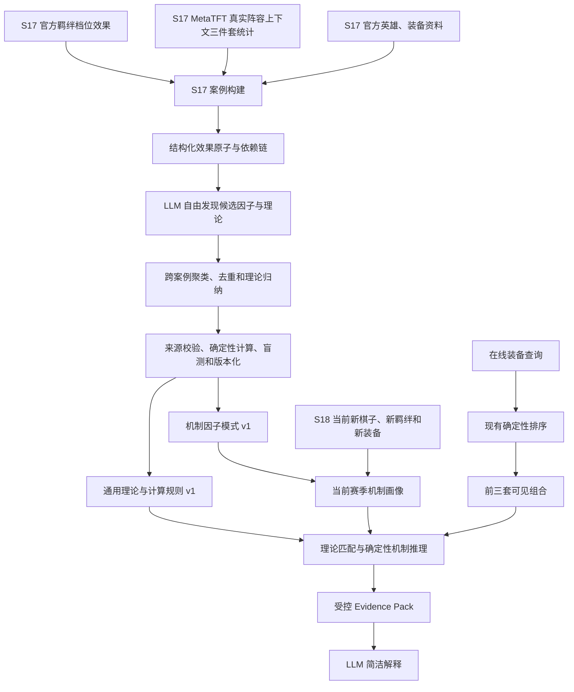

# S17 可迁移装备机制理论数据集与 S18 复用方案

> 状态：方案确认稿
> 更新日期：2026-07-28
> 适用范围：`unit_build_rankings`、`unit_build_completion`、`unit_best_3_items` 中已经由服务端查到并展示的装备组合解释

## 1. 文档目的

本方案定义如何使用 S17 的官方英雄、装备、羁绊资料和 MetaTFT 真实阵容上下文三件套统计建立机制发现数据集，通过 LLM 自下而上归纳可迁移的机制因子、数值联动关系和通用推理理论，并在 S18 及后续版本中应用于未参与 S17 学习的新棋子、新羁绊和新阵容。

S17 的用途不是积累“某英雄应该出某装备”的答案，而是学习：

```text
属性改变了哪个战斗环节
→ 不同属性如何互补、重复、稀释或形成条件联动
→ 如何把通用理论映射到当前版本的新实体
→ 如何解释当前统计已经查到的装备组合
```

最终目标不是让知识层重新选择装备，而是：

```text
服务端先查询、过滤并排序装备组合
→ 机制知识层解释已查到的组合
→ LLM 用简洁自然语言说明每件装备的作用、组合互补关系和候补取舍
```

本方案必须保证：

- MetaTFT 统计和现有确定性算法继续决定推荐、排序、核心装备与候选范围；
- 机制知识层只解释前端实际展示的组合，不新增、删除、替换或重排装备；
- S17 用于归纳“如何分析”的通用理论，S18 的具体英雄、装备、数值和统计仍以 S18 当前数据为准；
- 所有机制结论都能回链到当前版本官方技能、属性或装备效果；
- 统计相关性不得表述为因果关系；
- 用户已锁定装备仍是查询条件，不得被机制层判定为核心装备或优先补装。

## 2. 与现有交接文档的关系

`docs/equipment-conclusion-optimization-development-handoff.md` 代表上一阶段边界，其中英雄技能与通用游戏机制推理被明确排除。

本方案属于后续独立阶段，只覆盖以下旧边界：

- 允许目标棋子的当前版本官方技能描述和基础属性进入机制抽取；
- 允许使用由 S17 数据集自下而上发现、经过审核和版本化的通用机制因子；
- 允许使用这些因子解释已经由统计服务选出的装备组合。

以下旧边界继续有效：

- 不改变 MetaTFT 查询、过滤、排序和样本门槛；
- 不改变现有 `2/3` 核心装备判断；
- 不把 `lockedItems` 判定为核心或候补；
- 不分析前端未展示的隐藏组合；
- 不根据英雄机制自行推荐结果中不存在的装备；
- 不引入玩家实时局内状态、散件库存、站位或对手信息；
- 羁绊只在“主C + 三件套 + 真实阵容签名”的联合样本中进入机制推理，不枚举理论羁绊档位，也不把独立阵容统计强行拼接到装备统计。

## 3. 核心设计决策

### 3.1 数据集负责发现可迁移理论

S17 数据集用于让 LLM 发现：

- 英雄通过什么方式输出或发挥作用；
- 每件装备改变了哪个环节；
- 不同装备之间是互补、重复还是条件依赖；
- 替换一件装备后，组合获得和失去了什么；
- 哪些因素在多个英雄和多个组合中反复出现。
- 攻速、攻击触发、法力循环、暴击、伤害增幅、穿透和抗性处理之间存在哪些可复用关系；
- 哪些关系能够迁移到未参与发现的新英雄、新羁绊和新装备。

数据集不用于保存“霞必须出羊刀”“娜美必须出青龙刀”一类固定答案，也不在用户查询时重新训练模型。离线发现结果必须沉淀为显式、可审核、可版本化的理论库；在线阶段只检索并应用与当前场景有关的理论。

### 3.2 在线系统只解释已查到的组合

在线阶段只接收：

- 当前目标英雄；
- 前端实际展示的前三套组合；
- 当前组合统计；
- 当前版本英雄机制画像；
- 当前展示装备的机制画像；
- 与这些组合直接相关的推理记录。

完整 S17 数据集、隐藏候选和其他英雄案例不得进入本轮 Evidence Pack。

### 3.3 不要求玩家逐条撰写解释

LLM 可以根据以下证据发现候选原因：

- 当前版本英雄技能文本；
- 当前版本英雄定位和基础属性；
- 当前版本装备完整效果；
- 同一英雄的多套装备组合；
- 单装备位替换对照；
- 样本数和名次分布。

玩家或专家解释只用于小规模校准，不作为每条数据必填字段。建议准备 50～100 条专家审核案例，用于检查模型是否误解技能、忽略触发条件或夸大因果。

### 3.4 复用的是模式，不是赛季事实

S18 可以复用：

- 因子分类方法；
- 通用推理规则；
- 抽取、归纳、校验和 Evidence Pack 管道；
- 结论生成与降级机制。

S18 不得直接复用：

- S17 英雄机制画像；
- S17 装备效果；
- S17 三件套表现；
- S17 推荐顺序；
- 仅在 S17 成立的特殊互动。

### 3.5 “LLM 学习”的定义

首期的“学习”不等于把 S17 结论写入模型参数或直接微调模型，而是：

```text
LLM 分析 S17 案例并提出候选机制
→ 跨案例归纳通用因子、依赖链和数值关系
→ 通过来源校验、确定性计算、盲测和人工抽检
→ 发布显式机制理论库
→ 在线 LLM 检索理论并应用于当前新实体
```

这样可以单独修正错误理论、按版本使旧数值失效、更换 LLM 后继续复用知识，并避免把单赛季答案固化为永久规则。模型微调只能作为未来可选优化，不能替代理论库、当前官方资料和证据校验。

## 4. 总体架构



系统分成两条链路：

1. 离线知识发现链路：低频运行，负责发现和更新模式；
2. 在线解释链路：每次查询运行，只消费已经验证的结构化知识。

### 4.1 可行性结论

加入真实阵容羁绊上下文总体可行，推荐作为 S17 数据集的组成部分，但数据主链路必须使用 MetaTFT Explorer 的 `units_traits` 阵容变体签名，不能把 `/tft-comps-api/*` 的 `clusterId` 当成同一个概念。

仓库现有契约和 2026-07-28 实时探测证明：

- `/tft-explorer-api/exact_units_traits2` 可以按英雄、patch、days、rank 和 queue 返回真实单位—羁绊签名；
- 当次霞查询返回 250 个上下文变体；相同口径下不限制羁绊的霞样本约为 48.96 万局；
- 选择样本最高的真实签名后，将完整单位和羁绊签名作为 `sf` AND 条件请求 `unit_builds`，返回 459 条三件套记录；
- 该完整签名本身有 3,895 个样本，只约占霞无限制样本的 0.8%，因此它只是样本最高的单个完整排列，不能直接称为霞的主导上下文；
- `/tft-comps-api/comp_options` 与 `/tft-comps-api/comp_builds` 在同次检查中返回非 JSON，不能作为机制数据集的唯一依赖。

因此可行性分级为：

| 维度 | 结论 | 说明 |
|---|---|---|
| 联合统计正确性 | 高 | Explorer 可以在同一筛选口径下获得阵容签名和过滤后三件套 |
| 数据工程复杂度 | 中 | 需要为每个主C选择有限上下文并进行离线批量请求 |
| 在线接入复杂度 | 中 | 需要上下文分布、羁绊画像和新的证据校验 |
| 在线实时请求可行性 | 低 | 每次查询追加多个上下文请求会增加延迟和第三方故障面 |
| 离线预计算可行性 | 高 | 先用完整签名发现真实上下文，再按与主C机制有关的羁绊档位聚合 |
| S18 复用性 | 中高 | 可复用发现和推理模式，但必须重建 S18 羁绊档位映射 |

结论：采用“离线完整签名发现 + 同口径羁绊聚合 + 在线命中 + 不可用时降级”的方案，不把样本最高的单一完整阵容误当成主导上下文，也不采用“在线穷举上下文”或“全局装备统计与独立阵容统计拼接”的方案。

### 4.2 羁绊上下文不进入首个 MVP

羁绊上下文在理论上可行，但它同时引入：

- 完整阵容签名极度碎片化；
- 多个解释上下文可能重叠；
- 羁绊档位映射随赛季变化；
- 特殊效果分支不一定能够安全聚合；
- 上下文越细，三件套联合统计越不稳定。

因此羁绊不是方案成立的必要条件，而是提高解释深度的第二阶段能力。发布分为两版：

#### v0.1：不含羁绊

首个 MVP 只处理：

- 英雄技能；
- 英雄基础属性；
- 装备当前效果和数值；
- 无羁绊限制的三件套统计；
- 单槽替换关系；
- 结构化效果原子、数值联动和通用理论。

v0.1 的首要目标是验证：从 S17 发现的机制理论，能否在不依赖阵容羁绊的情况下正确解释未参与发现的英雄及其已查询装备组合。

#### v0.2：加入高置信度羁绊

只有同时满足以下条件的羁绊才能进入解释：

- 对目标棋子或其输出过程直接生效；
- 当前官方档位映射明确；
- 三件套—羁绊联合样本充足；
- 相对无限制构筑的覆盖率达到门槛；
- 主要解释上下文之间的装备结论一致，或差异能够被明确分层说明。

v0.2 继续遵循：

```text
完整阵容签名用于事实与审计
→ 抽取对主C实际生效的羁绊
→ 按解释上下文聚合
→ 计算覆盖率
→ 只有高覆盖时才能解释
```

所有羁绊采集、画像、聚合和在线推理模块必须保持可选；缺失或失败时回到 v0.1，不得阻塞首个 MVP 或影响现有推荐查询。

## 5. S17 数据集设计

### 5.1 数据来源

英雄静态资料：

```text
https://game.gtimg.cn/images/lol/act/img/tft/js/chess.js
```

现有解析器：

```text
src/data/official-entity-details.js
```

使用字段：

- `role`
- `stats.attackDamage`
- `stats.attackSpeed`
- `stats.attackRange`
- `stats.mana`
- `stats.startingMana`
- `stats.critChance`
- `ability.name`
- `ability.type`
- `ability.description`

装备静态资料：

```text
https://game.gtimg.cn/images/lol/act/img/tft/js/equip.js
```

现有解析器：

```text
src/data/official-item-details.js
```

使用字段：

- `name`
- `effect`
- `keywords`
- `craftable`
- `apiName`

三件套统计：

```text
MetaTFT /tft-explorer-api/unit_builds
```

现有客户端和适配器：

```text
src/data/metatft-client.js
src/data/metatft-response-adapter.js
src/core/query-planner.js
src/core/stats-calculator.js
```

采集前必须确认第三方数据的授权、使用条款和合理请求频率。若无法获得稳定授权，长期替代方案是通过 Riot `tft-league-v1` 与 `tft-match-v1` 获取原始对局并自行聚合。

真实阵容上下文：

```text
MetaTFT /tft-explorer-api/exact_units_traits2
→ 取得当前英雄的真实 units_traits 变体签名
→ 选择有限的高覆盖签名
→ 使用完整单位和羁绊签名过滤 /tft-explorer-api/unit_builds/{unit}
```

现有实现：

```text
src/core/comp-filter.js
src/core/default-context-builder.js
docs/metatft-data-explorer-comp-contract.md
```

注意：

- Explorer 的 Comp 身份是 `units_traits` 变体签名，不是 `/comps` 的 `clusterId`；
- `/comps` 的 cluster 只能作为已验证的辅助别名，不能作为联合统计主键；
- `traits` 中的数字后缀是 MetaTFT 档位索引，不一定等于实际激活人数；
- 档位索引必须映射到当前官方 `trait.levels` 后，才能生成“4羁绊A”之类的用户可见描述；
- 内部角色标签、召唤物标签和无法映射到官方效果的 token 可以参与上下文身份，但不得直接进入用户解释。

### 5.2 固定统计口径

同一批发现数据必须使用一致口径：

```json
{
  "queue": "RANKED_TFT",
  "patch": "具体 S17 patch",
  "days": 30,
  "rankFilter": ["CHALLENGER", "GRANDMASTER", "MASTER"],
  "starLevel": 2,
  "itemCount": 3
}
```

实际枚举沿用项目当前 MetaTFT 参数。不得把不同 patch、天数、段位或队列的数据无标记混合。

每次快照必须记录：

- Season 和 patch；
- 查询参数；
- 抓取时间；
- Provider 及版本；
- 原始响应摘要或内容哈希；
- 官方静态资料版本与内容哈希。

### 5.3 原始案例格式

建议使用 JSONL，每行一个英雄三件套案例：

```json
{
  "schemaVersion": "mechanism_case.v1",
  "caseId": "set17:17.x:TFT17_Unit:item-a|item-b|item-c",
  "season": "S17",
  "patch": "17.x",
  "queryContext": {
    "queue": "RANKED_TFT",
    "days": 30,
    "rankFilter": ["MASTER", "GRANDMASTER", "CHALLENGER"],
    "starLevel": 2,
    "itemCount": 3
  },
  "unit": {
    "apiName": "TFT17_Unit",
    "name": "英雄名",
    "role": "官方定位",
    "stats": {},
    "ability": {
      "name": "技能名",
      "type": "官方技能类型",
      "description": "官方技能描述"
    },
    "sourceVersion": "官方资料版本",
    "sourceHash": "sha256"
  },
  "items": [
    {
      "apiName": "TFT_Item_A",
      "name": "装备A",
      "effect": "官方完整效果",
      "sourceVersion": "官方资料版本",
      "sourceHash": "sha256"
    }
  ],
  "compContext": {
    "contextId": "sha256(normalized units_traits signature)",
    "contextSemanticsVersion": "metatft-explorer-sf-units-traits-v1",
    "explorerSignature": {
      "units": ["TFT17_Unit", "TFT17_OtherUnit"],
      "traits": ["TFT17_TraitA_2", "TFT17_TraitB_1"]
    },
    "publicActiveTraits": [
      {
        "apiName": "TFT17_TraitA",
        "filterId": "TFT17_TraitA_2",
        "tierIndex": 2,
        "unitsRequired": 4,
        "effect": "官方当前档位效果",
        "sourceHash": "sha256"
      }
    ],
    "contextGames": 0,
    "buildContextGames": 0,
    "buildContextCoverage": null
  },
  "placementCount": [0, 0, 0, 0, 0, 0, 0, 0],
  "stats": {
    "games": 0,
    "avgPlacement": null,
    "top4Rate": null,
    "winRate": null
  },
  "source": {
    "provider": "MetaTFT",
    "capturedAt": "ISO-8601",
    "requestFingerprint": "sha256"
  }
}
```

三件装备必须使用稳定排序生成 `caseId`，但同时保留原接口数据，避免丢失重复装备和来源信息。

加入上下文后的案例主键为：

```text
patch
+ 主C API Name
+ 排序后的三件装备多重集
+ Explorer 上下文签名哈希
+ 用户可见激活羁绊签名
```

用户可见羁绊签名示例：

```text
TFT17_TraitA:4|TFT17_TraitB:2
```

Explorer 原始签名必须同时保留，不能只保留简化后的用户可见羁绊；不同阵容可能具有相同公共羁绊，但单位和特殊变体不同。

### 5.4 样本规模

建议规模。表中的“案例”指 `主C + 三件套 + 真实阵容上下文`，不是脱离阵容的三件套：

| 阶段 | 代表性组合案例 | 目标 |
|---|---:|---|
| 原型 | 300～500 | 验证能否发现稳定因子 |
| 首个可用版本 | 800～1500 | 覆盖全部英雄和主要装备机制 |
| 跨 patch 完善 | 2000～4000 | 验证稳定性并发现稀有机制 |

组合案例数与背后对局数必须分开。单组合统计按以下等级保存：

| `games` | 使用方式 |
|---:|---|
| `<100` | 可参与机制文本分析，不用于验证表现规律 |
| `100～399` | 弱统计证据，必须标记低样本 |
| `400～999` | 可用于一般替换对照 |
| `>=1000` | 较强统计证据 |
| `>=3000` | 可支持高覆盖普适性观察 |

所有原始组合都可保存，但进入 LLM 因子发现集时应分层采样，避免高频英雄和高样本组合垄断语料。

### 5.5 分层采样

每个英雄应尽量覆盖：

- 样本最高的组合；
- 指标表现较好的组合；
- 指标表现一般或较差的组合；
- 中低样本组合；
- 只替换一个装备位的成对组合；
- 重复强化同一属性的组合；
- 覆盖不同作用方向的组合；
- 普通装备、神器、光明装备和转职分别分层。

不应简单选择每个英雄样本最高的前 N 套。因子发现依赖差异性，尤其依赖单槽替换对照。

### 5.6 数据划分

建议按英雄分组划分，而不是随机拆分组合：

```text
70% 英雄：因子发现集
15% 英雄：模式调整集
15% 英雄：完全盲测集
```

同一英雄的组合不得同时出现在发现集和盲测集，否则无法检验模式对未见英雄的泛化能力。

额外准备 50～100 条专家审核案例，覆盖物理持续输出、法术爆发、技能循环、前排坦克、功能辅助以及带特殊触发条件的装备。

### 5.7 真实阵容上下文采集

每个主C先调用一次 `exact_units_traits2`，用完整单位—羁绊签名证明这些上下文真实出现过。完整签名是事实来源和审计键，不直接作为最终解释分组，因为换一个前排棋子、内部专属标签或观星分支就会把同一主C体系拆成大量小样本。

采集分两层：

1. 完整签名层：保留接口返回的真实 `units + traits`、样本数和来源，用于去重、审计和确认没有构造理论阵容；
2. 解释上下文层：从真实签名中提取对目标主C或其装备机制直接生效的羁绊档位，按相同解释签名聚合。

例如霞的解释上下文可以分成：

```text
主因子：2狙神 / 3狙神
次级特殊环境：蟒蛇观星 / 圣坛观星 / 其他观星效果
其余前排、唯一羁绊和内部标签：保留在完整签名中，不默认进入霞的装备解释
```

“主因子”和“次级环境”不是由名称或出现顺序决定，而是由当前官方效果、对目标棋子的适用性和跨上下文装备相对排名变化共同判断。

对候选解释上下文，使用同一 Explorer 口径实际过滤 `unit_builds`，得到：

```text
主C + 三件套 + 实际激活羁绊档位 + 八档名次分布
```

不得仅把多份完整签名的样本数在本地相加后冒充联合查询；聚合上下文必须能够通过同口径过滤请求复现。特殊羁绊的不同效果分支默认分层保留，只有验证为同一机制条件时才允许合并。

每个主C设置离线请求预算和覆盖目标，而不是固定“只取前三个完整签名”。优先采集能够覆盖主要装备样本的少量解释上下文；无法达到覆盖门槛时不加入羁绊解释。

这项工作应在离线采集任务中限速、缓存并支持失败续跑，不应添加到普通用户查询的实时关键路径。

### 5.8 上下文分布与主导上下文

对同一个 `主C + 三件套`，使用预计算联合表生成：

```json
{
  "build": ["装备A", "装备B", "装备C"],
  "unrestrictedGames": 10000,
  "capturedContextCoverage": 0.89,
  "contexts": [
    {
      "contextId": "context-a",
      "traitSignature": "TraitA:4|TraitB:2",
      "games": 6800,
      "coverage": 0.68
    },
    {
      "contextId": "context-b",
      "traitSignature": "TraitA:6|TraitC:2",
      "games": 2100,
      "coverage": 0.21
    }
  ]
}
```

定义：

```text
coverage(context, build)
= games(context ∩ build) / unrestrictedGames(build)

capturedContextCoverage
= Σ games(已采集且互斥的 context ∩ build) / unrestrictedGames(build)
```

这里的 `context` 指经过同口径过滤复现的解释上下文，不是单个完整九人阵容签名。在确认上下文互斥、没有重复计数后，首版可使用以下候选门槛：

- 上下文本身和联合构筑都达到现有稳定样本门槛；
- `capturedContextCoverage >= 0.80`；
- 第一上下文 `coverage >= 0.60`；
- 第一与第二上下文的覆盖率差至少 0.20。

满足时可标记 `dominantContext=true`。这些数值是首版评估参数，必须通过 S17 分布报告调整，不写入 Prompt。

没有主导上下文时：

1. 选择累计覆盖主要样本的多个上下文；
2. 只保留在这些上下文中达到高加权覆盖的公共羁绊；
3. 公共羁绊仍不足时，不使用羁绊解释；
4. 不得把样本最高的单一阵容当成所有样本的共同条件。

优先级：

```text
用户明确指定且接口实际过滤的阵容/羁绊
> 当前三件套的稳定主导上下文
> 多个主要上下文的高覆盖公共羁绊
> 不使用羁绊解释
```

### 5.9 羁绊档位与官方效果映射

羁绊机制证据必须同时满足：

- MetaTFT 真实上下文中存在对应 `filterId`；
- 当前官方目录存在对应羁绊；
- MetaTFT 档位索引可映射到当前官方 `levels[索引]`；
- 当前档位效果文本可用；
- 该羁绊确实对目标英雄或其输出过程生效。

当前 `src/data/domain-alias-overrides.js` 的 `TRAIT_TIER_COUNTS` 是 S17 人工维护映射，可继续作为兼容校验，但 S18 迁移前应改为“官方 levels 自动生成 + 少量审核例外”，避免每个赛季手工重写完整档位表。

### 5.10 结构化效果原子与数值字段

仅保存“提高输出频率”“提供增伤”等自然语言标签不足以支持跨赛季推理。英雄、装备和羁绊的当前官方效果还必须抽取为统一的效果原子：

```json
{
  "schemaVersion": "mechanic_atom.v1",
  "atomId": "atom:trait:attack-speed:1",
  "season": "S17",
  "patch": "17.x",
  "sourceType": "trait",
  "sourceApiName": "TFT17_Trait",
  "effectType": "attackSpeed",
  "operation": "add",
  "value": 0.30,
  "unit": "ratio",
  "target": "eligibleAllies",
  "trigger": "traitActive",
  "conditions": [],
  "stackingGroup": "attackSpeed",
  "sourceRefs": ["levels[0].effect"],
  "sourceHash": "sha256",
  "confidence": 0.98
}
```

首版至少覆盖：

- 面板攻击力、法强、攻速、暴击率和暴击伤害；
- 每次攻击回蓝、初始法力、最大法力和施法触发；
- 普攻触发、施法触发、每 N 次触发、叠层和启动时间；
- 伤害增幅、易伤、穿透、减甲和抗性削减，并保持概念分离；
- 目标、持续时间、上限、触发条件和作用对象；
- 已验证的计算分组 `stackingGroup`，未知时必须为空，不得猜测。

数值无法从官方文本可靠解析、计算口径未知或存在争议时，保留原文并输出 `unresolvedNumericSemantics`，只能生成定性解释，不能进入精确乘区计算。

## 6. 自下而上因子发现

### 6.1 第一轮：逐案例自由抽取

首轮不得给模型一份完整固定因子枚举。只提供任务边界和证据要求，让模型自由提出因素。

每个案例输出：

```json
{
  "schemaVersion": "factor_candidate.v1",
  "caseId": "原案例ID",
  "unitObservations": [
    {
      "label": "持续普攻输出",
      "description": "英雄主要依赖连续普攻造成伤害",
      "sourceRefs": ["unit.ability.description", "unit.stats.attackSpeed"],
      "confidence": 0.86
    }
  ],
  "itemObservations": [
    {
      "itemApiName": "TFT_Item_A",
      "label": "提高攻击频率",
      "description": "装备提供攻速或持续攻速成长",
      "sourceRefs": ["items[0].effect"],
      "conditions": [],
      "confidence": 0.93
    }
  ],
  "traitObservations": [
    {
      "traitApiName": "TFT17_TraitA",
      "tier": 4,
      "label": "阵容已提供攻击频率",
      "description": "当前真实阵容中的已激活档位为目标棋子提供攻速",
      "sourceRefs": ["compContext.publicActiveTraits[0].effect"],
      "confidence": 0.91
    }
  ],
  "relationshipCandidates": [
    {
      "label": "不同输出维度互补",
      "items": ["TFT_Item_A", "TFT_Item_B", "TFT_Item_C"],
      "reason": "分别强化伤害基础、频率和放大效果",
      "sourceRefs": [
        "unit.ability.description",
        "items[0].effect",
        "items[1].effect",
        "items[2].effect"
      ],
      "claimType": "mechanism_inference",
      "confidence": 0.79
    }
  ],
  "statisticalObservations": [],
  "unknownFactors": []
}
```

要求：

- 每条事实必须引用输入字段；
- 不允许使用模型记忆补充技能或装备效果；
- 允许提出自由标签；
- 必须区分官方事实、统计事实和机制推断；
- 不得把佩戴行为表述为玩家真实意图；
- 不得把组合表现差异表述为装备导致的结果；
- 条件性装备效果必须保留触发条件。
- 不得从“装备没有继续堆某属性”单独推断羁绊已经满足该属性；只有当前羁绊官方效果和同上下文替换对照共同支持时，才能形成带统计边界的关系推断。

### 6.2 第二轮：跨案例归并

将自由标签分批聚类，处理：

- 同义词合并；
- 父子概念归类；
- 过度宽泛概念拆分；
- 过度具体概念抽象；
- 条件机制与永久属性分离；
- 增伤、穿透、减甲等易混概念分离；
- 稀有但有明确官方证据的机制保留。

示例：

```text
“攻速提升”“攻击次数增加”“持续叠攻速”
→ 可归到“输出频率”
→ 但保留“立即生效”与“需要叠层”两个条件子因子
```

### 6.3 第三轮：生成模块化模式

模式示例仅表示可能的归纳结果，不作为开发前预置答案：

```text
英雄作用方式
├── 普攻
├── 技能
├── 混合
├── 持续
└── 爆发

装备作用维度
├── 伤害基础
├── 输出频率
├── 伤害放大
├── 抗性处理
├── 技能循环
├── 生存
└── 功能性

生效条件
├── 启动时间
├── 叠层
├── 目标状态
├── 自身生命状态
└── 施放或攻击触发

组合关系
├── 互补
├── 重复
├── 条件协同
├── 条件冲突
└── 无充分证据
```

最终模式必须记录：

- `factorId`
- 名称和定义；
- 父因子；
- 正例；
- 反例；
- 容易混淆的相邻因子；
- 是否需要条件；
- 首次发现来源；
- 支持案例数；
- 适用赛季；
- 审核状态。

最终产物必须是跨实体理论，不能只是案例标签。例如应归纳为：

```text
攻击频率提高
+ 每次攻击触发资源回复
+ 棋子依赖该资源施法
→ 攻击频率会提高单位时间资源获取并可能缩短施法周期
```

不得归纳为：

```text
娜美 + 太空律动 → 青龙刀
```

### 6.4 因子饱和判定

每增加 100 条代表性案例重新执行一次归并。如果连续两个批次同时满足：

- 新增有效因子少于已有因子的 5%；
- 所有主要英雄作用类型已覆盖；
- 相同概念开始大量重复；
- 盲测解释覆盖率不再明显提高；

则可认为 S17 基础模式达到首版饱和。

## 7. 通用推理规则

### 7.1 规则来源

规则由已归并的因子和跨案例关系生成，并经过确定性校验与人工抽检。不得按英雄名或装备名编写规则。

允许：

```text
英雄依靠持续普攻
+ 装备提高攻击频率
→ 该装备与英雄输出方式存在机制契合
```

禁止：

```text
霞 → 必须出羊刀
娜美 → 必须出青龙刀
```

### 7.2 规则格式

```json
{
  "schemaVersion": "mechanism_rule.v1",
  "ruleId": "sustained_basic_attack_frequency.v1",
  "premises": [
    {
      "subject": "unit",
      "factor": "持续普攻输出"
    },
    {
      "subject": "item",
      "factor": "提高攻击频率"
    }
  ],
  "conclusion": {
    "relation": "mechanism_fit",
    "textTemplate": "该装备提高攻击频率，与棋子的持续普攻输出方式契合"
  },
  "limitations": [
    "不能据此新增或重排装备",
    "不能据此声称装备导致统计指标提升",
    "存在启动条件时必须一并说明"
  ],
  "supportingCaseCount": 0,
  "reviewStatus": "approved"
}
```

### 7.3 “乘区”表述边界

除非当前版本官方公式或经过审核的确定性计算能够证明，不得直接声称多个效果属于独立乘区并严格相乘。

默认使用：

```text
不同输出维度互补
```

只有证据充分时才使用：

```text
独立伤害乘区
```

面板属性、攻击频率、暴击、伤害增幅、穿透和抗性削减必须保持不同概念，不能因为都能提高伤害而合并。

### 7.4 数值联动与机制依赖链

理论库需要表达“一个效果如何改变另一个效果的实际收益”，而不只表达两个标签相关。首版至少支持以下关系：

- 放大：攻速提高会增加每次攻击触发效果的单位时间触发次数；
- 循环：攻击回蓝、施法回蓝和最大法力共同影响预计施法间隔；
- 阈值：数值变化可能使施法、叠层或每 N 次触发减少一次所需动作；
- 同类稀释：同一已验证加算组已有数值越高，追加同类数值的相对边际收益可能越低；
- 跨维度互补：伤害基础、攻击频率、暴击、抗性处理和已验证独立增幅分别作用于不同环节；
- 条件冲突：触发条件、作用对象或持续时间不匹配时，不得声称联动。

机制依赖链格式：

```json
{
  "schemaVersion": "mechanism_dependency.v1",
  "dependencyId": "attack-speed_to_mana-per-attack.v1",
  "inputs": [
    "effect:attackSpeed",
    "effect:manaPerAttack",
    "unit:castsWithMana"
  ],
  "steps": [
    "attackSpeed -> attacksPerSecond",
    "attacksPerSecond * manaPerAttack -> manaPerSecond",
    "manaPerSecond + otherManaSources -> estimatedCastInterval"
  ],
  "relation": "conditional_complement",
  "formulaStatus": "verified",
  "sourceRefs": [],
  "limitations": [
    "需要当前版本攻速和法力规则",
    "存在攻速上限、锁蓝或特殊施法规则时必须单独处理"
  ],
  "reviewStatus": "approved"
}
```

公式由确定性计算器执行，LLM 负责从官方资料提出候选依赖、解释计算结果和处理自然语言。LLM 不得自行心算关键数值，也不得在 `formulaStatus` 未验证时声称精确乘区。

对于“羁绊已经给了增伤，所以装备不应继续出增伤”，系统必须输出边际关系而不是绝对禁用：

```text
已验证为同一加算组
→ 计算追加增伤的相对边际收益
→ 与补充其他维度的可见候选进行比较
→ 只解释当前统计已经选出的组合，不据此新增或删除装备
```

### 7.5 理论发现、盲测与迁移门槛

通用理论必须通过按英雄隔离的盲测：发现阶段不向 LLM 提供盲测英雄案例，验证阶段只提供该英雄当前官方技能、羁绊和装备效果，检查理论能否解释其已查询组合。

理论发布至少需要：

- 在多个不同英雄或装备案例中重复出现，而不是单案例记忆；
- 每个前提都能映射到结构化效果原子；
- 涉及数值时有已验证公式或明确的定性降级；
- 在未参与发现的 S17 英雄上达到解释正确性门槛；
- 不包含具体英雄名、装备名或阵容名作为通用规则前提；
- 明确适用条件、反例、失败条件和可信度。

S18 新实体能够完整映射到已发布前提时，可以直接应用旧理论；出现新触发方式、新资源或无法映射的效果时必须进入增量发现，不能强行类比。

## 8. 结构化机制画像

因子模式确认后，再批量将 S17 英雄和装备映射为结构化画像。画像是发现流程的产物，不是开发者预先写死的字典。

英雄画像：

```json
{
  "schemaVersion": "unit_mechanism_profile.v1",
  "season": "S17",
  "patch": "17.x",
  "unitApiName": "TFT17_Unit",
  "factors": [
    {
      "factorId": "factor:unit-output:physical-sustained",
      "sourceRefs": ["ability.description", "stats.attackDamage"],
      "confidence": 0.91
    }
  ],
  "sourceHash": "sha256",
  "profileStatus": "validated"
}
```

装备画像：

```json
{
  "schemaVersion": "item_mechanism_profile.v1",
  "season": "S17",
  "patch": "17.x",
  "itemApiName": "TFT_Item_A",
  "factors": [
    {
      "factorId": "factor:item:output-frequency",
      "sourceRefs": ["effect"],
      "conditions": ["需要攻击叠层"],
      "confidence": 0.95
    }
  ],
  "sourceHash": "sha256",
  "profileStatus": "validated"
}
```

任何画像都必须绑定 Season、patch 和官方文本哈希。同名英雄或装备在文本变化后必须重新抽取。

羁绊档位画像：

```json
{
  "schemaVersion": "trait_mechanism_profile.v1",
  "season": "S17",
  "patch": "17.x",
  "traitApiName": "TFT17_TraitA",
  "filterId": "TFT17_TraitA_2",
  "tierIndex": 2,
  "unitsRequired": 4,
  "effect": "官方当前档位效果",
  "factors": [
    {
      "factorId": "factor:trait:output-frequency",
      "sourceRefs": ["levels[1].effect"],
      "conditions": ["仅在该档位实际激活时生效"],
      "confidence": 0.94
    }
  ],
  "sourceHash": "sha256",
  "profileStatus": "validated"
}
```

## 9. 在线解释链路

### 9.1 执行顺序

```text
用户问题
→ 现有 MetaTFT 查询
→ 现有过滤、样本处理和排序
→ 前端前三套组合
→ 加载当前英雄、可见装备及可用真实羁绊上下文画像
→ 使用通用规则生成组合推理
→ 组装 Evidence Pack
→ LLM 生成简洁解释
→ Validator 校验
→ 成功结果或安全降级
```

### 9.2 机制推理记录

```json
{
  "schemaVersion": "mechanism_inference.v1",
  "inferenceId": "mechanism-inference:build-1:1",
  "targetBuildEvidenceId": "build:1",
  "claim": "三件装备分别强化伤害基础、暴击收益和条件增伤，作用维度互补",
  "ruleIds": [
    "complementary-output-dimensions.v1"
  ],
  "sourceEvidenceIds": [
    "unit-mechanic-profile:1",
    "item-mechanic-profile:1",
    "item-mechanic-profile:2",
    "item-mechanic-profile:3"
  ],
  "claimType": "mechanism_inference",
  "causal": false,
  "confidence": 0.88
}
```

LLM 只能表述已经存在的 `mechanism_inference`，不在运行时自由创造新的装备关系。

### 9.3 Evidence Pack 扩展

在现有 Evidence Pack 中增加：

```json
{
  "unitMechanismProfiles": [],
  "itemMechanismProfiles": [],
  "traitMechanismProfiles": [],
  "buildContextDistributions": [],
  "mechanismInferences": [],
  "mechanismStatus": {
    "available": true,
    "schemaVersion": "mechanism-factor-schema.v1",
    "season": "S17",
    "patch": "17.x",
    "missingProfiles": []
  }
}
```

首期接入位置：

- `src/llm/conclusion-evidence.js`
- `src/retrieval/evidence-assembler.js`
- `src/llm/conclusion-spec-registry.js`
- `src/llm/conclusion-validator.js`
- `src/llm/prompts/conclusion-intents/unit-build-rankings.md`
- `src/core/conclusion-service.js`

### 9.4 证据容量

不得把完整数据集、全部规则或所有官方长文本塞入每次请求。

本轮只发送：

- 一个目标英雄画像；
- 前三套实际出现装备的去重画像；
- 每套方案最多一个主导上下文，或多个主要上下文的高覆盖公共羁绊；
- 最多发送与当前装备解释直接相关的 1～2 条羁绊档位效果；
- 每套方案最相关的机制推理；
- 必要的当前官方原文片段；
- 当前前三套统计证据。

核心装备、优先保证和候补装备都必须有对应效果解释。相同装备效果只发送一次，通过 Evidence ID 复用。

上下文证据还必须携带：

- 联合构筑样本数；
- 相对无限制构筑样本的覆盖率；
- 已捕获上下文总覆盖率；
- 主导上下文判定版本；
- 上下文与本次查询条件是否同口径。

缺少任一必要覆盖证据时，不得使用羁绊解释无限制查询。

### 9.5 查询边界

普通三件套查询：

- 排名仍由现有服务端决定；
- 核心仍由现有 `2/3` 规则决定；
- 机制层解释核心装备及可见候补的作用；
- 机制互补不能提升装备身份。
- 只有当前三件套存在稳定主导上下文或高覆盖公共羁绊时，才加入羁绊作用；
- 只能说“这套装备主要出现在……”或“当前已覆盖的主要上下文普遍……”，不得说全部样本都来自该阵容。

已携带装备查询：

- `lockedItems` 只作为前置条件；
- 机制层可以说明已携带装备在完整组合中的作用；
- 不得把它称为核心、候补或优先保证；
- “最大区分装备”仍由现有确定性统计信号决定；
- 机制层只解释该区分装备为何可能产生不同的组合取向。

用户明确阵容/羁绊查询：

- 必须确认最终 `unit_builds` 请求确实使用对应 `sf` 或 trait 条件；
- 使用被实际过滤的上下文，不再额外推断默认主导阵容；
- 用户输入本身不能替代接口过滤结果；
- 过滤后联合样本不足时仍按低样本处理。

### 9.6 降级

以下情况不得导致主查询失败：

- 机制画像缺失；
- 羁绊档位无法映射；
- 上下文覆盖不足或查询口径不一致；
- 画像版本与当前 patch 不一致；
- 新机制无法映射；
- 机制推理服务失败；
- LLM 结论校验失败。

降级顺序：

```text
完整机制解释
→ 不含羁绊的英雄技能 + 装备效果解释
→ 当前官方装备效果的保守解释
→ 仅展示确定性推荐摘要
```

任何降级都不得改变前三套卡片及其统计。

## 10. S18 复用流程

### 10.1 新赛季启动

S18 官方资料可用后：

1. 抓取 S18 英雄、装备和羁绊目录；
2. 从 S18 当前官方文本抽取结构化效果原子，不复用 S17 实体数值；
3. 对 S18 英雄、装备和羁绊重新生成当前画像；
4. 尝试映射到 S17 发现的 `mechanism-factor-schema.v1`、依赖链和通用理论；
5. 对可以完整映射的实体运行确定性联动计算和迁移解释；
6. 对无法映射的效果生成 `unmapped_factor`；
7. 聚合未知因素，运行小规模增量发现；
8. 通过盲测和审核后发布新版本理论；
9. 使用 S18 MetaTFT 统计继续决定推荐和排序。

### 10.2 未知因素格式

```json
{
  "schemaVersion": "unmapped_factor.v1",
  "season": "S18",
  "entityApiName": "TFT18_NewEntity",
  "proposedLabel": "根据距离动态改变技能形态",
  "description": "现有 S17 因子无法完整表达该机制",
  "sourceRefs": ["ability.description"],
  "confidence": 0.84,
  "status": "pending_review"
}
```

不得把未知机制强行映射到最相近的旧因子。

### 10.3 S18 冷启动表述

S18 统计样本不足时可以说：

```text
根据当前技能和装备效果，这套组合在机制上分别补充攻击频率、伤害基础和暴击收益。
```

不得说：

```text
这是 S18 最稳定、胜率最高或唯一正确的组合。
```

只有 S18 当前统计达到现有业务门槛后，才能恢复对应的普适推荐和表现结论。

### 10.4 数据集和理论库更新机制

更新分为三种频率，不能混为一次全量重建：

| 更新对象 | 建议触发 | 处理方式 |
|---|---|---|
| 官方英雄、装备、羁绊资料 | 新赛季或版本更新 | 比较 `sourceHash`，只重新抽取发生变化的实体 |
| MetaTFT 构筑和上下文统计 | 每日、每 3 日或版本窗口 | 生成独立统计快照，不修改机制理论定义 |
| 因子、依赖链和通用理论 | 出现 `unmapped_factor`、盲测失败或积累足够新案例 | 增量发现、审核并发布新版本 |

更新流程：

```text
抓取当前官方资料
→ 与上版内容哈希比较
→ 失效发生变化的效果原子和实体画像
→ 沿依赖关系找到受影响的联动结论
→ 只重算受影响部分
→ 刷新当前统计快照
→ 运行盲测、回归测试和人工抽检
→ 发布新版本，保留旧版本用于回滚
```

旧赛季统计、实体数值和画像保持不可变归档，不得覆盖到新赛季；通用理论只有在其前提仍被当前实体完整满足时才能复用。

## 11. 文件与模块规划

建议新增：

```text
src/knowledge/
  mechanism-schema.js
  mechanic-atom-extractor.js
  mechanism-case-builder.js
  mechanism-context-builder.js
  mechanism-context-distribution.js
  mechanism-extraction-provider.js
  mechanism-factor-normalizer.js
  mechanism-dependency-graph.js
  mechanism-formula-engine.js
  mechanism-theory-registry.js
  mechanism-transfer-mapper.js
  mechanism-profile-validator.js
  mechanism-rule-engine.js
  mechanism-profile-store.js

scripts/
  capture-s17-mechanism-cases.mjs
  capture-s17-build-contexts.mjs
  sample-mechanism-cases.mjs
  discover-mechanism-factors.mjs
  build-mechanism-schema.mjs
  build-mechanism-theories.mjs
  build-mechanism-profiles.mjs
  evaluate-mechanism-explanations.mjs
  evaluate-mechanism-transfer.mjs

data/generated/mechanisms/
  s17/
    mechanic-atoms.v1.json
    factor-schema.v1.json
    rules.v1.json
    dependencies.v1.json
    formulas.v1.json
    theories.v1.json
    unit-profiles.v1.json
    item-profiles.v1.json
    trait-profiles.v1.json
    build-context-distributions.v1.json

test/fixtures/mechanism-knowledge/
  discovery/
  validation/
  s18-transfer/
```

原始第三方统计快照是否进入 Git 必须按授权、体积和隐私要求决定。默认建议：

- 原始响应保存在受控离线存储；
- Git 只保存脱敏、小规模、可复现的测试 fixture；
- 生成后的模式、规则和画像可版本化提交；
- 不保存玩家 PUUID 或其他不需要的个人标识。

## 12. 实施阶段

### 阶段 A1：v0.1 基础数据采集

- 新增全英雄 S17 三件套快照脚本；
- 固定查询口径；
- 保留完整响应，不在采集层截断前三套；
- 关联当前官方英雄和装备文本；
- 抽取英雄和装备的结构化效果原子及数值字段；
- 生成 `mechanism_case.v1`；
- 输出缺失资料和重复案例报告。

验收：

- 当前赛季全部可查询英雄均有采集状态；
- 每条案例可回链到官方英雄和三件装备；
- `placementCount` 与派生统计一致；
- 每个已解析数值都带单位、条件、来源和当前版本哈希；
- 不同 patch 和查询条件不会被静默合并。

### 阶段 A2：v0.2 羁绊上下文采集

本阶段在 v0.1 验收完成后启动，不阻塞 v0.1：

- 新增真实阵容签名和上下文过滤三件套采集脚本；
- 关联当前官方羁绊档位文本；
- 保留完整真实签名，并按对主C直接生效的羁绊档位构建可复现的聚合解释上下文；
- 抽取羁绊的结构化效果原子及数值字段；
- 输出上下文覆盖率、重叠风险、特殊分支和联合样本稳定性报告。

验收：

- 每条羁绊案例可回链到实际使用的当前官方羁绊档位；
- 联合上下文构筑样本来自实际过滤后的同口径请求；
- 不会把 `/comps clusterId` 与 Explorer 变体签名混为同一 ID；
- 不会把样本最高但覆盖率很低的单个完整签名称为主导上下文；
- 特殊效果分支不会为了扩大样本而被无条件合并；
- 羁绊数据不可用时不影响 v0.1 数据集和解释链路。

### 阶段 B：因子发现

- 分层选择 300～500 条原型案例；
- 运行逐案例自由因子抽取；
- 执行跨案例聚类与去重；
- 增加到 800～1500 条并检查因子饱和；
- 形成 `factor-schema.v1` 候选；
- 从跨案例关系归纳机制依赖链和通用理论候选；
- 完成人工抽检和版本冻结。

验收：

- 每个因子有来源、定义、正例和反例；
- 事实性机制声明可回链到官方文本；
- 不存在按具体英雄或装备名称硬编码的通用规则；
- 不存在“某英雄必须出某装备”形式的赛季答案；
- 未知和争议因素不会被强制定类。

### 阶段 C：画像和规则

- 批量生成 S17 英雄与装备画像；
- 生成通用规则候选；
- 建立数值依赖图，对已验证关系实现确定性计算；
- 对盲测英雄运行解释；
- 使用未参与发现的英雄验证理论迁移能力；
- 使用专家校准集修正错误；
- 冻结首版画像和规则。

验收：

- 盲测按英雄隔离；
- 当前技能或装备文本变化会使旧画像失效；
- 条件性效果不会被表述为永久效果；
- “增伤、穿透、减甲、暴击”等概念不会混淆；
- 已验证数值联动由计算器执行，而不是由 LLM 自由心算；
- 盲测英雄不依赖训练案例中的同名英雄或装备规则也能得到正确机制解释。

### 阶段 C2：v0.2 羁绊画像和规则

- 批量生成 S17 羁绊档位画像和三件套上下文分布；
- 将羁绊效果映射到已验证的机制因子和依赖链；
- 检查羁绊加入前后是否改变装备相对排序或只改变整体强度；
- 对羁绊主因子、特殊环境因子和无关阵容标签进行分层；
- 验证覆盖率、上下文一致性和安全降级。

验收：

- 当前羁绊档位文本变化会使对应羁绊画像和依赖推理失效；
- 不满足高置信度条件的羁绊不会进入在线 Evidence Pack；
- 关闭全部羁绊模块后，系统行为与 v0.1 一致。

### 阶段 D1：v0.1 在线接入

- 扩展 Evidence Pack；
- 为前三套组合生成英雄技能、基础属性、装备效果和单槽替换推理；
- 更新 Prompt 与 Validator；
- 保持现有 UI 结构；
- 对核心和全部可见候补装备提供效果解读；
- 增加安全降级。

验收：

- 推荐顺序与接入前完全一致；
- 核心装备和锁定装备身份与接入前完全一致；
- 结论只分析前端前三套；
- 每件被解释的装备都有当前官方效果证据；
- LLM 不需要依靠模型记忆补充机制；
- 机制层故障不影响推荐卡片返回。

### 阶段 D2：v0.2 羁绊在线接入

- 只为达到发布门槛的羁绊上下文扩展 Evidence Pack；
- 每条羁绊解释携带真实联合上下文、覆盖率和当前官方档位效果；
- 上下文覆盖不足、分支冲突或样本不稳定时自动回到 v0.1；
- 验证加入羁绊前后推荐顺序、核心身份和候补范围完全不变。

### 阶段 E：S18 迁移演练

在 S17 内模拟未来赛季：

- 按英雄分组保留盲测集；
- 人为隐藏一部分已知因子，测试 `unmapped_factor`；
- 修改 fixture 中的英雄技能或装备效果，验证哈希失效；
- 确认旧统计不会进入新版本结论；
- 确认新实体可由当前资料映射到旧理论并生成解释；
- 确认新机制能进入增量发现流程；
- 确认修改一个实体数值只会使依赖它的画像和推理失效。

## 13. 评估指标

数据质量：

- 英雄官方资料关联覆盖率；
- 装备官方资料关联覆盖率；
- 案例去重率；
- 单槽替换对照覆盖率；
- 真实上下文捕获覆盖率；
- 三件套—上下文联合样本覆盖率；
- 羁绊档位官方映射覆盖率；
- 各英雄类型和装备类型覆盖率。

机制抽取：

- 官方原文回链率；
- 结构化效果原子抽取准确率；
- 数值、单位、触发条件和作用对象保留准确率；
- 条件保留准确率；
- 机制分类一致率；
- 未知因素正确拒绝率；
- 同义因子归并准确率。

理论与迁移：

- 通用理论跨英雄支持案例数；
- 按英雄隔离盲测正确率；
- 新实体映射到旧理论的准确率；
- 数值依赖链计算一致率；
- 同区稀释、跨维度互补和条件联动误判率；
- `unmapped_factor` 召回率；
- 规则中具体英雄名或装备名硬编码数量。

在线结论：

- 前三套范围遵守率；
- 推荐顺序保持率；
- 锁定条件误判率；
- 核心装备误判率；
- 装备效果覆盖率；
- 羁绊上下文误用率；
- 主导上下文覆盖声明准确率；
- 无证据机制声明率；
- 因果越界率；
- LLM 生成成功率和安全降级率。

首版硬性要求：

- 推荐顺序保持率：100%；
- 锁定装备被判为核心或优先补装：0；
- 引用当前官方文本之外的装备效果：0；
- 未经联合统计证明而拼接羁绊解释：0；
- 分析隐藏组合：0；
- 机制层故障影响主查询成功：0。

其余指标先在原型阶段建立基线，再根据真实评测结果设定发布门槛，不凭空指定。

## 14. 风险与控制

### 14.1 选择偏差

最终棋盘装备不能代表玩家的真实意图，高表现组合也可能依赖阵容、强化符文或对局条件。

控制：

- 使用“机制上契合”“与当前表现相关”等表述；
- 不声称玩家选择装备的真实原因；
- 不把相关性写成因果；
- 优先使用单槽替换对照，但仍保留非因果限制。

### 14.2 上下文碎片化

加入阵容签名后，同一个三件套会被拆分到多个上下文，联合样本显著小于无限制样本。

控制：

- 完整真实签名用于发现和审计，不把样本最高的单个完整排列直接当成主导上下文；
- 按对主C直接生效的羁绊档位构建少量、可通过同口径请求复现的聚合解释上下文；
- 同时保留无限制三件套作为覆盖率分母；
- 主导上下文必须同时满足覆盖率和稳定样本门槛；
- 特殊羁绊的不同效果分支默认分层，不能为了扩大样本而无条件合并；
- 低覆盖时完全移除羁绊解释，不用低样本上下文填充。

### 14.3 高样本偏置

只看高样本会让模式偏向最流行装备，只看高表现会让模式偏向条件型低样本组合。

控制：

- 按样本和表现分层采样；
- 保留普通、高表现、低表现和低样本案例；
- 发现阶段与在线普适推荐评分相互独立。

### 14.4 LLM 自洽性幻觉

模型可能生成听起来合理但官方文本不支持的解释。

控制：

- 逐声明绑定 `sourceRefs`；
- 数字和实体白名单校验；
- 当前版本文本哈希；
- 无法回链则拒绝画像或推理；
- 在线 LLM 只复述已验证推理记录。

### 14.5 跨赛季概念漂移

S18 可能出现 S17 从未见过的新机制。

控制：

- 开放式 `unmapped_factor`；
- 增量模式版本；
- 不强制映射；
- 旧画像按 Season、patch 和内容哈希隔离。

### 14.6 第三方数据稳定性

MetaTFT 接口属于第三方依赖，接口、限制或授权可能变化。

控制：

- 采集器与在线客户端解耦；
- 保存请求指纹和来源；
- 限速、缓存和失败续跑；
- 以 Explorer `units_traits` 签名为事实主键，不依赖当前不稳定的 `/comps` JSON；
- 明确授权后再建立长期数据集；
- 保留 Riot 官方比赛数据自行聚合的替代路径。

## 15. 最终交付物

S17 阶段完成后应交付：

1. S17 机制案例数据集及数据说明；
2. 数据采集和分层采样脚本；
3. 自下而上因子发现结果；
4. `mechanic-atoms.v1` 与数值语义报告；
5. `mechanism-factor-schema.v1`；
6. `mechanism-dependencies.v1`、`mechanism-formulas.v1` 和通用理论库；
7. `mechanism-rules.v1`；
8. S17 英雄与装备机制画像；
9. 按英雄隔离的理论迁移盲测集；
10. 50～100 条专家校准案例；
11. v0.1 机制解释与迁移评估报告；
12. v0.1 在线 Evidence Pack、Prompt、Validator 和降级接入；
13. v0.2 S17 羁绊档位画像、三件套上下文分布和覆盖率报告；
14. v0.2 羁绊在线接入与独立评估报告；
15. S18 新实体映射、新机制发现与理论升级流程。

## 16. 完成定义

本方案完成的标准不是“LLM 能生成一段听起来合理的话”。

### 16.1 首个 MVP（v0.1）

- 不依赖羁绊上下文即可完成英雄技能、基础属性、装备效果、三件套统计和单槽替换解释；
- S17 数据能够产生不依赖具体英雄名和装备名的通用依赖链、数值关系和机制理论；
- 理论能够只根据当前官方资料解释未参与发现的 S17 英雄组合；
- 核心和全部可见候补装备都有当前官方效果与机制解读；
- 推荐、排序、核心装备和锁定条件业务逻辑不变；
- 机制层失败时仍能安全返回现有推荐结果；
- 羁绊数据、采集器和画像均不是 v0.1 的发布依赖。

### 16.2 羁绊增强版（v0.2）及完整方案

在 v0.1 全部成立的基础上：

- S17 数据能够自下而上产生可复核的机制因子；
- 在线解释只针对现有查询已经选出的装备组合；
- 每条机制结论都能追溯到当前官方事实与已审核规则；
- 精确乘区和数值联动由已验证公式及确定性计算支持，证据不足时自动降级为定性解释；
- 羁绊解释只来自真实联合上下文，无法证明覆盖时会自动退出；
- S18 可以重新解析当前资料，将新棋子、新羁绊和新装备映射到已知理论，并识别无法映射的新机制；
- 新版本只增量重建发生变化及受其依赖的知识，不需要重新制作全部固定解释；
- S17 的旧统计和旧实体画像不会污染 S18 结论。
